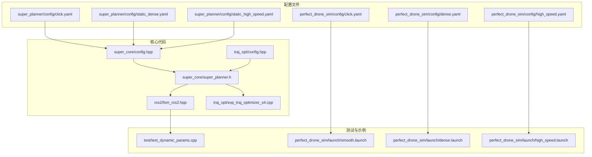
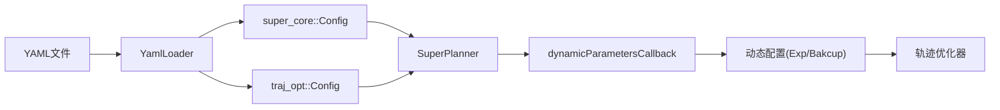

# 配置与参数管理

<cite>
**本文引用的文件**
- [CONFIGURATION_GUIDE.md](file://src/SUPER/super_planner/docs/CONFIGURATION_GUIDE.md)
- [click.yaml](file://src/SUPER/super_planner/config/click.yaml)
- [static_dense.yaml](file://src/SUPER/super_planner/config/static_dense.yaml)
- [static_high_speed.yaml](file://src/SUPER/super_planner/config/static_high_speed.yaml)
- [config.hpp](file://src/SUPER/super_planner/include/super_core/config.hpp)
- [config.hpp](file://src/SUPER/super_planner/include/traj_opt/config.hpp)
- [super_planner.h](file://src/SUPER/super_planner/include/super_core/super_planner.h)
- [fsm_ros2.hpp](file://src/SUPER/super_planner/include/ros_interface/ros2/fsm_ros2.hpp)
- [exp_traj_optimizer_s4.cpp](file://src/SUPER/super_planner/src/traj_opt/exp_traj_optimizer_s4.cpp)
- [test_dynamic_params.cpp](file://src/SUPER/super_planner/test/test_dynamic_params.cpp)
- [click.yaml](file://src/SUPER/mars_uav_sim/perfect_drone_sim/config/click.yaml)
- [dense.yaml](file://src/SUPER/mars_uav_sim/perfect_drone_sim/config/dense.yaml)
- [high_speed.yaml](file://src/SUPER/mars_uav_sim/perfect_drone_sim/config/high_speed.yaml)
- [smooth.launch](file://src/SUPER/mars_uav_sim/perfect_drone_sim/launch/smooth.launch)
- [high_speed.launch](file://src/SUPER/mars_uav_sim/perfect_drone_sim/launch/high_speed.launch)
- [dense.launch](file://src/SUPER/mars_uav_sim/perfect_drone_sim/launch/dense.launch)
</cite>

## 目录
1. [简介](#简介)
2. [项目结构](#项目结构)
3. [核心组件](#核心组件)
4. [架构总览](#架构总览)
5. [详细组件分析](#详细组件分析)
6. [依赖关系分析](#依赖关系分析)
7. [性能考量](#性能考量)
8. [故障排查指南](#故障排查指南)
9. [结论](#结论)
10. [附录](#附录)

## 简介
本文件面向“配置与参数管理系统”，围绕以下目标展开：
- 解释配置文件的结构与组织方式，包括参数分类、默认值设置与参数验证机制
- 深入描述动态参数调优系统，包括运行时参数更新、参数回调机制与调优策略
- 提供典型场景的配置示例：点击演示、高密度环境、静态场景等
- 解释参数对系统性能的影响与调优指南
- 给出参数配置最佳实践与常见陷阱
- 提供参数系统的API参考与使用示例
- 解释配置文件的版本管理与迁移策略
- 提供参数调试与验证的方法与工具

## 项目结构
本项目采用“按功能域分层 + YAML配置”的组织方式：
- 配置文件集中于各模块的 config 目录，采用 YAML 结构化存储
- 参数加载与验证通过通用的 YAML 加载器实现
- 动态参数通过 ROS2 参数服务器与回调机制实现热更新
- 场景化配置通过不同 YAML 文件与 launch 文件组合实现



图表来源
- [click.yaml](file://src/SUPER/super_planner/config/click.yaml#L1-L190)
- [static_dense.yaml](file://src/SUPER/super_planner/config/static_dense.yaml#L1-L186)
- [static_high_speed.yaml](file://src/SUPER/super_planner/config/static_high_speed.yaml#L1-L187)
- [config.hpp](file://src/SUPER/super_planner/include/super_core/config.hpp#L96-L151)
- [config.hpp](file://src/SUPER/super_planner/include/traj_opt/config.hpp#L110-L179)
- [super_planner.h](file://src/SUPER/super_planner/include/super_core/super_planner.h#L32-L74)
- [fsm_ros2.hpp](file://src/SUPER/super_planner/include/ros_interface/ros2/fsm_ros2.hpp#L441-L467)
- [exp_traj_optimizer_s4.cpp](file://src/SUPER/super_planner/src/traj_opt/exp_traj_optimizer_s4.cpp#L778-L806)
- [test_dynamic_params.cpp](file://src/SUPER/super_planner/test/test_dynamic_params.cpp#L10-L103)
- [smooth.launch](file://src/SUPER/mars_uav_sim/perfect_drone_sim/launch/smooth.launch#L1-L20)
- [dense.launch](file://src/SUPER/mars_uav_sim/perfect_drone_sim/launch/dense.launch#L1-L20)
- [high_speed.launch](file://src/SUPER/mars_uav_sim/perfect_drone_sim/launch/high_speed.launch#L1-L20)

章节来源
- [CONFIGURATION_GUIDE.md](file://src/SUPER/super_planner/docs/CONFIGURATION_GUIDE.md#L9-L17)
- [click.yaml](file://src/SUPER/super_planner/config/click.yaml#L1-L190)
- [static_dense.yaml](file://src/SUPER/super_planner/config/static_dense.yaml#L1-L186)
- [static_high_speed.yaml](file://src/SUPER/super_planner/config/static_high_speed.yaml#L1-L187)

## 核心组件
- 配置加载与验证
  - 通过 YAML 加载器从配置文件读取参数，并提供默认值与类型校验
  - 支持命名空间参数加载，便于同一文件中管理多套配置
- 运行时参数更新
  - 通过 ROS2 参数服务器与回调机制，实现参数热更新
  - 更新后同步到轨迹优化器等子模块
- 参数分类与默认值
  - 轨迹优化边界约束、惩罚权重、平滑与精度参数
  - 地图与走廊生成参数
  - 视觉与仿真相关参数
- 场景化配置
  - 提供点击演示、高密度、高动态等预设场景配置
  - 通过 launch 文件选择对应配置

章节来源
- [config.hpp](file://src/SUPER/super_planner/include/super_core/config.hpp#L96-L151)
- [config.hpp](file://src/SUPER/super_planner/include/traj_opt/config.hpp#L110-L179)
- [super_planner.h](file://src/SUPER/super_planner/include/super_core/super_planner.h#L32-L74)
- [fsm_ros2.hpp](file://src/SUPER/super_planner/include/ros_interface/ros2/fsm_ros2.hpp#L441-L467)
- [exp_traj_optimizer_s4.cpp](file://src/SUPER/super_planner/src/traj_opt/exp_traj_optimizer_s4.cpp#L778-L806)

## 架构总览
参数系统由“配置文件 -> 加载器 -> 配置对象 -> 运行时回调 -> 子模块”构成的链路组成。

```mermaid
sequenceDiagram
participant User as "用户/CLI"
participant ParamSrv as "ROS2参数服务器"
participant Callback as "动态参数回调"
participant Planner as "SuperPlanner"
participant DynCfg as "动态配置(Exp/Bakcup)"
participant Opt as "轨迹优化器"
User->>ParamSrv : 设置参数(traj_opt.*)
ParamSrv-->>Callback : 触发动态参数回调
Callback->>Planner : updateRuntimeParams(node)
Planner->>DynCfg : 同步边界与惩罚参数
DynCfg-->>Opt : 锁定并更新优化器参数
Opt-->>Planner : 返回更新完成
Planner-->>User : 参数生效
```

图表来源
- [fsm_ros2.hpp](file://src/SUPER/super_planner/include/ros_interface/ros2/fsm_ros2.hpp#L441-L467)
- [super_planner.h](file://src/SUPER/super_planner/include/super_core/super_planner.h#L241-L259)
- [exp_traj_optimizer_s4.cpp](file://src/SUPER/super_planner/src/traj_opt/exp_traj_optimizer_s4.cpp#L778-L806)

## 详细组件分析

### 配置文件结构与参数分类
- 主要参数类别
  - 规划与地图：分辨率、感知范围、走廊参数、机器人半径等
  - 轨迹优化：边界约束（速度/加速度/加加速度/角速度/推力）、惩罚权重、平滑与精度、分段数等
  - 扁平性模型：质量、阻力、重力、推力系数等
  - A*与ROG地图：启发式类型、虚拟地面/天花板、ESDF等
- 默认值与校验
  - 加载器在读取参数时提供默认值；部分参数在加载后进行尺寸/范围校验
  - 场景配置文件提供典型参数组合，便于直接使用

章节来源
- [click.yaml](file://src/SUPER/super_planner/config/click.yaml#L15-L190)
- [static_dense.yaml](file://src/SUPER/super_planner/config/static_dense.yaml#L11-L186)
- [static_high_speed.yaml](file://src/SUPER/super_planner/config/static_high_speed.yaml#L11-L187)
- [CONFIGURATION_GUIDE.md](file://src/SUPER/super_planner/docs/CONFIGURATION_GUIDE.md#L21-L171)

### 参数加载与验证机制
- YAML加载器
  - 支持路径解析与命名空间拼接，实现多配置共存
  - 内置模板方法，统一处理参数读取、默认值与必需参数标记
- 参数验证
  - 数组/向量参数在读取后进行长度校验，异常时抛出错误
  - 边界参数在读取后参与派生参数计算（如轨迹采样步长）

章节来源
- [config.hpp](file://src/SUPER/super_planner/include/super_core/config.hpp#L96-L151)
- [config.hpp](file://src/SUPER/super_planner/include/traj_opt/config.hpp#L110-L179)
- [rog_map_core/config.hpp](file://src/SUPER/rog_map/include/rog_map/rog_map_core/config.hpp#L194-L223)

### 动态参数调优系统
- 运行时参数更新
  - 通过 ROS2 参数服务器设置参数键值
  - 回调函数触发后，将参数同步到 SuperPlanner 的配置对象
  - 同步到轨迹优化器的动态配置，保证实时生效
- 参数回调机制
  - 在回调中依次更新 SuperPlanner 与各优化器的动态配置
  - 通过互斥锁保护动态配置更新过程
- 调优策略
  - 优先调整边界约束与惩罚权重，再微调平滑与精度
  - 高速场景强调边界约束，精细避障强调位置约束与平滑

章节来源
- [super_planner.h](file://src/SUPER/super_planner/include/super_core/super_planner.h#L241-L259)
- [fsm_ros2.hpp](file://src/SUPER/super_planner/include/ros_interface/ros2/fsm_ros2.hpp#L441-L467)
- [exp_traj_optimizer_s4.cpp](file://src/SUPER/super_planner/src/traj_opt/exp_traj_optimizer_s4.cpp#L778-L806)
- [CONFIGURATION_GUIDE.md](file://src/SUPER/super_planner/docs/CONFIGURATION_GUIDE.md#L174-L223)

### 场景化配置示例
- 点击演示
  - 通过 launch 文件指定配置文件名，结合 RViz 进行可视化演示
- 高密度环境
  - 提升边界约束与位置惩罚权重，降低平滑以提升响应速度
- 高速场景
  - 提高最大速度/加加速度，适度放松位置约束，增强时间惩罚权重

章节来源
- [click.yaml](file://src/SUPER/mars_uav_sim/perfect_drone_sim/config/click.yaml#L1-L30)
- [dense.yaml](file://src/SUPER/mars_uav_sim/perfect_drone_sim/config/dense.yaml#L1-L30)
- [high_speed.yaml](file://src/SUPER/mars_uav_sim/perfect_drone_sim/config/high_speed.yaml#L1-L30)
- [smooth.launch](file://src/SUPER/mars_uav_sim/perfect_drone_sim/launch/smooth.launch#L1-L20)
- [dense.launch](file://src/SUPER/mars_uav_sim/perfect_drone_sim/launch/dense.launch#L1-L20)
- [high_speed.launch](file://src/SUPER/mars_uav_sim/perfect_drone_sim/launch/high_speed.launch#L1-L20)
- [CONFIGURATION_GUIDE.md](file://src/SUPER/super_planner/docs/CONFIGURATION_GUIDE.md#L226-L288)

### 参数对系统性能的影响与调优指南
- 影响因素
  - 边界约束：决定轨迹可行性与安全性
  - 惩罚权重：影响轨迹形状、平滑度与时间长度
  - 平滑与精度：影响优化收敛速度与轨迹质量
- 调优建议
  - 先保守设置，逐步放宽约束，再提升性能
  - 高速场景优先保证边界安全，再优化轨迹长度
  - 避免一次性调整过多参数，便于定位影响因素

章节来源
- [CONFIGURATION_GUIDE.md](file://src/SUPER/super_planner/docs/CONFIGURATION_GUIDE.md#L68-L113)
- [CONFIGURATION_GUIDE.md](file://src/SUPER/super_planner/docs/CONFIGURATION_GUIDE.md#L325-L385)

### API参考与使用示例
- 参数设置与查询
  - 使用 CLI 设置参数键值，键名遵循“命名空间.参数名”
  - 使用 CLI 查询参数列表与当前值
- 动态参数回调
  - 回调函数负责同步参数到 SuperPlanner 与优化器
- 测试脚本
  - 提供参数设置、查询与结果检查的完整流程

章节来源
- [CONFIGURATION_GUIDE.md](file://src/SUPER/super_planner/docs/CONFIGURATION_GUIDE.md#L174-L223)
- [test_dynamic_params.cpp](file://src/SUPER/super_planner/test/test_dynamic_params.cpp#L10-L103)

### 版本管理与迁移策略
- 版本管理
  - 通过不同场景配置文件区分版本与用途
  - 建议在参数文件中保留注释说明参数含义与来源
- 迁移策略
  - 新增参数时提供默认值，避免破坏旧配置
  - 场景配置文件可作为“参数快照”，便于回滚与对比
  - 建议在升级后执行参数一致性检查与回归测试

章节来源
- [CONFIGURATION_GUIDE.md](file://src/SUPER/super_planner/docs/CONFIGURATION_GUIDE.md#L314-L322)

### 调试与验证方法
- 调试流程
  - 编译与启动节点
  - 使用 rqt_reconfigure 实时调整参数
  - 观察 RViz 可视化与日志输出
  - 导出最优参数到配置文件固化
- 常见问题与修复
  - 优化失败：检查走廊有效性、降低惩罚权重或提高精度
  - 轨迹不连续：增加加加速度惩罚与平滑参数
  - 规划缓慢：降低分辨率、精度与积分分辨率

章节来源
- [CONFIGURATION_GUIDE.md](file://src/SUPER/super_planner/docs/CONFIGURATION_GUIDE.md#L291-L323)
- [CONFIGURATION_GUIDE.md](file://src/SUPER/super_planner/docs/CONFIGURATION_GUIDE.md#L325-L385)

## 依赖关系分析
- 配置加载依赖
  - YAML 加载器依赖 YAML 文件与命名空间解析
  - 配置对象依赖加载器提供的默认值与校验
- 运行时依赖
  - 动态参数回调依赖 ROS2 参数服务器与节点句柄
  - 动态配置同步依赖互斥锁与优化器接口



图表来源
- [config.hpp](file://src/SUPER/super_planner/include/super_core/config.hpp#L96-L151)
- [config.hpp](file://src/SUPER/super_planner/include/traj_opt/config.hpp#L110-L179)
- [super_planner.h](file://src/SUPER/super_planner/include/super_core/super_planner.h#L32-L74)
- [fsm_ros2.hpp](file://src/SUPER/super_planner/include/ros_interface/ros2/fsm_ros2.hpp#L441-L467)
- [exp_traj_optimizer_s4.cpp](file://src/SUPER/super_planner/src/traj_opt/exp_traj_optimizer_s4.cpp#L778-L806)

章节来源
- [config.hpp](file://src/SUPER/super_planner/include/super_core/config.hpp#L96-L151)
- [config.hpp](file://src/SUPER/super_planner/include/traj_opt/config.hpp#L110-L179)
- [super_planner.h](file://src/SUPER/super_planner/include/super_core/super_planner.h#L32-L74)
- [fsm_ros2.hpp](file://src/SUPER/super_planner/include/ros_interface/ros2/fsm_ros2.hpp#L441-L467)
- [exp_traj_optimizer_s4.cpp](file://src/SUPER/super_planner/src/traj_opt/exp_traj_optimizer_s4.cpp#L778-L806)

## 性能考量
- 参数对性能的影响
  - 边界约束过严导致优化困难，适当放宽可提升成功率
  - 惩罚权重影响轨迹质量与优化收敛速度
  - 平滑与精度参数直接影响计算耗时与轨迹平滑度
- 优化建议
  - 高速场景优先保证边界安全，再优化轨迹长度
  - 避免一次性调整过多参数，便于定位影响因素
  - 使用场景化配置文件作为基准，逐步微调

[本节为通用指导，无需列出具体文件来源]

## 故障排查指南
- 优化失败
  - 检查走廊有效性与初始值合理性
  - 降低惩罚权重或提高优化精度
- 轨迹不连续
  - 增加加加速度惩罚与平滑参数
- 规划缓慢
  - 降低分辨率、精度与积分分辨率
- 动态参数不生效
  - 检查参数名大小写与回调是否触发
  - 必要时强制重新加载参数

章节来源
- [CONFIGURATION_GUIDE.md](file://src/SUPER/super_planner/docs/CONFIGURATION_GUIDE.md#L325-L385)

## 结论
本参数系统通过 YAML 配置与 ROS2 动态参数相结合，实现了灵活、可扩展且可调试的参数管理能力。通过场景化配置与调优指南，用户可在不同应用环境中快速获得稳定且高性能的轨迹规划效果。建议在工程实践中建立参数版本管理与回归测试流程，确保参数变更的可控性与可追溯性。

[本节为总结性内容，无需列出具体文件来源]

## 附录
- 参数键名规范
  - 命名空间遵循“super_planner”“traj_opt”等，参数名区分大小写
- 常用命令
  - 设置参数、查询参数、导出参数到 YAML 文件
- 场景切换
  - 通过 launch 文件选择对应配置文件，快速切换不同场景

章节来源
- [CONFIGURATION_GUIDE.md](file://src/SUPER/super_planner/docs/CONFIGURATION_GUIDE.md#L174-L223)
- [CONFIGURATION_GUIDE.md](file://src/SUPER/super_planner/docs/CONFIGURATION_GUIDE.md#L291-L323)