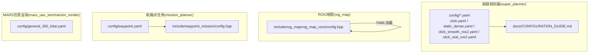
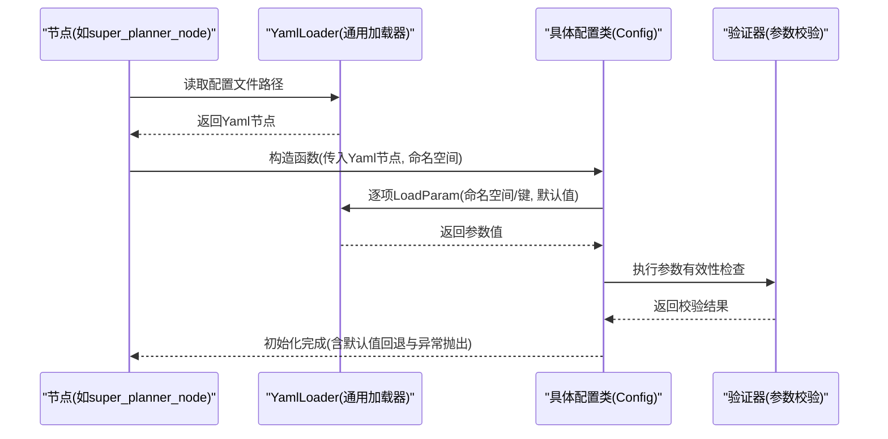
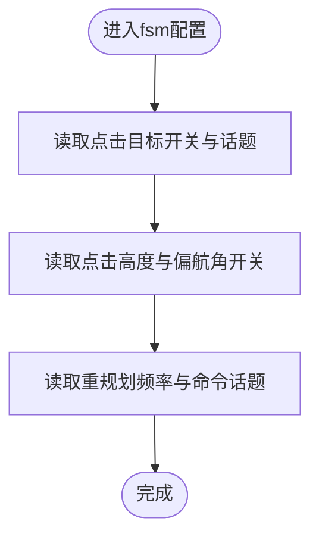
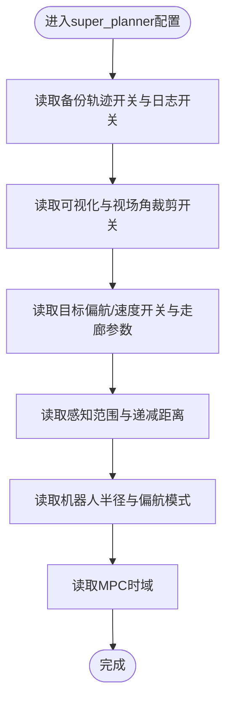
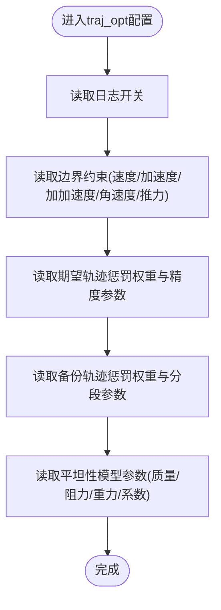
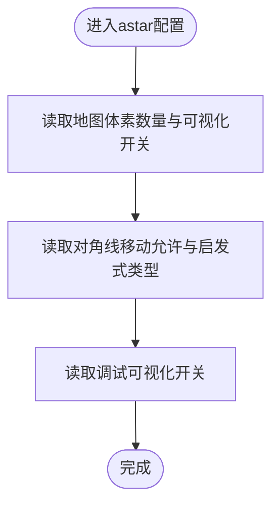
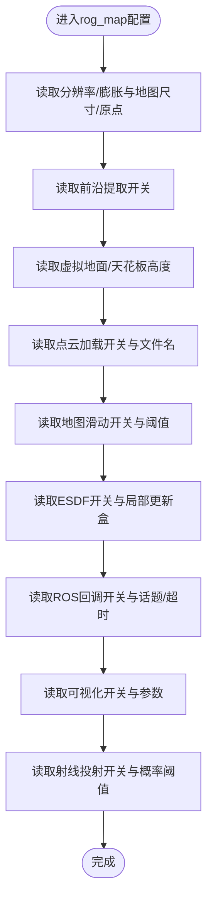
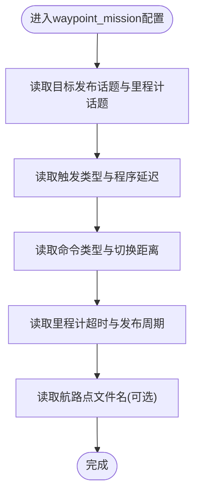
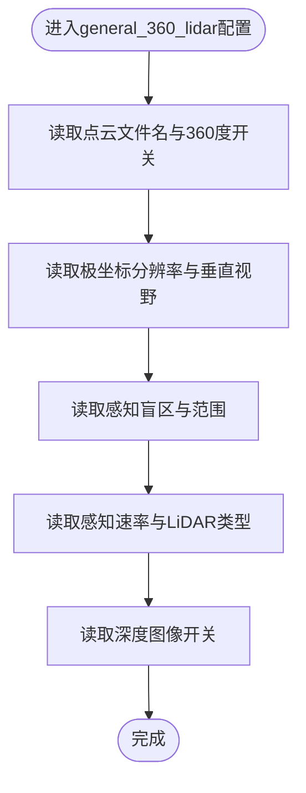
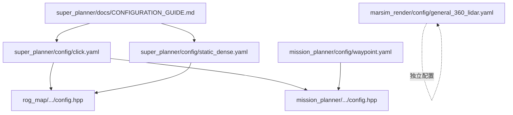

# 配置文件结构与组织

<cite>
**本文档引用的文件**
- [src/SUPER/super_planner/config/click.yaml](file://src/SUPER/super_planner/config/click.yaml)
- [src/SUPER/super_planner/config/static_dense.yaml](file://src/SUPER/super_planner/config/static_dense.yaml)
- [src/SUPER/super_planner/docs/CONFIGURATION_GUIDE.md](file://src/SUPER/super_planner/docs/CONFIGURATION_GUIDE.md)
- [src/SUPER/rog_map/include/rog_map/rog_map_core/config.hpp](file://src/SUPER/rog_map/include/rog_map/rog_map_core/config.hpp)
- [src/SUPER/mission_planner/config/waypoint.yaml](file://src/SUPER/mission_planner/config/waypoint.yaml)
- [src/SUPER/mission_planner/include/waypoint_mission/config.hpp](file://src/SUPER/mission_planner/include/waypoint_mission/config.hpp)
- [src/SUPER/mars_uav_sim/marsim_render/config/general_360_lidar.yaml](file://src/SUPER/mars_uav_sim/marsim_render/config/general_360_lidar.yaml)
</cite>

## 目录
1. [简介](#简介)
2. [项目结构](#项目结构)
3. [核心组件](#核心组件)
4. [架构总览](#架构总览)
5. [详细组件分析](#详细组件分析)
6. [依赖关系分析](#依赖关系分析)
7. [性能考虑](#性能考虑)
8. [故障排查指南](#故障排查指南)
9. [结论](#结论)
10. [附录](#附录)

## 简介
本文件系统性梳理了该ROS2项目中配置文件的整体架构与组织方式，重点覆盖以下方面：
- 配置文件的层次结构与命名规范
- 配置分类体系：FSM状态机、超级规划器、轨迹优化、A*路径搜索、ROG地图等
- 配置项命名约定与常见缩写含义
- 配置文件的加载顺序与优先级规则
- 验证规则与错误检查机制
- 版本控制与兼容性管理策略
- 提供完整示例与注释说明

## 项目结构
该项目采用按功能域划分的目录结构，配置文件主要分布在各功能包的config目录中，并通过各自的加载器解析。整体结构如下：

**图表来源**
- [src/SUPER/super_planner/config/click.yaml](file://src/SUPER/super_planner/config/click.yaml#L1-L190)
- [src/SUPER/super_planner/config/static_dense.yaml](file://src/SUPER/super_planner/config/static_dense.yaml#L1-L186)
- [src/SUPER/super_planner/docs/CONFIGURATION_GUIDE.md](file://src/SUPER/super_planner/docs/CONFIGURATION_GUIDE.md#L1-L411)
- [src/SUPER/rog_map/include/rog_map/rog_map_core/config.hpp](file://src/SUPER/rog_map/include/rog_map/rog_map_core/config.hpp#L68-L288)
- [src/SUPER/mission_planner/config/waypoint.yaml](file://src/SUPER/mission_planner/config/waypoint.yaml#L1-L19)
- [src/SUPER/mission_planner/include/waypoint_mission/config.hpp](file://src/SUPER/mission_planner/include/waypoint_mission/config.hpp#L82-L96)
- [src/SUPER/mars_uav_sim/marsim_render/config/general_360_lidar.yaml](file://src/SUPER/mars_uav_sim/marsim_render/config/general_360_lidar.yaml#L1-L16)

**章节来源**
- [src/SUPER/super_planner/config/click.yaml](file://src/SUPER/super_planner/config/click.yaml#L1-L190)
- [src/SUPER/super_planner/config/static_dense.yaml](file://src/SUPER/super_planner/config/static_dense.yaml#L1-L186)
- [src/SUPER/super_planner/docs/CONFIGURATION_GUIDE.md](file://src/SUPER/super_planner/docs/CONFIGURATION_GUIDE.md#L1-L411)

## 核心组件
本节概述各配置模块的职责与典型参数类别，便于理解配置文件的分类体系。

- FSM状态机配置(fsm)
  - 作用：管理无人机飞行状态机，如点击目标、重规划频率、命令话题等
  - 关键参数：点击目标开关、话题名称、重规划频率、命令发布话题等
  - 参考路径：[src/SUPER/super_planner/config/click.yaml](file://src/SUPER/super_planner/config/click.yaml#L3-L11)

- 超级规划器配置(super_planner)
  - 作用：核心轨迹规划参数，如走廊边界、感知范围、MPC时域等
  - 关键参数：走廊边界距离、感知范围、递减距离、机器人半径、偏航模式等
  - 参考路径：[src/SUPER/super_planner/config/click.yaml](file://src/SUPER/super_planner/config/click.yaml#L15-L37)

- 轨迹优化配置(traj_opt)
  - 作用：探索轨迹与备份轨迹的优化边界、惩罚权重、平滑与精度控制
  - 关键参数：边界约束(速度/加速度/加加速度/角速度/推力)、期望轨迹与备份轨迹的惩罚权重、积分分辨率、平滑参数等
  - 参考路径：[src/SUPER/super_planner/config/click.yaml](file://src/SUPER/super_planner/config/click.yaml#L40-L102)

- A*路径搜索配置(astar)
  - 作用：网格分辨率、启发式函数类型、对角线移动允许等
  - 关键参数：地图体素数量、启发式类型、调试可视化等
  - 参考路径：[src/SUPER/super_planner/config/click.yaml](file://src/SUPER/super_planner/config/click.yaml#L105-L116)

- ROG地图配置(rog_map)
  - 作用：地图分辨率、膨胀、未知区域处理、ROS回调、可视化、射线投射概率参数等
  - 关键参数：分辨率、膨胀步数、地图尺寸、ROS回调话题、可视化范围、射线投射范围与概率阈值等
  - 参考路径：[src/SUPER/super_planner/config/click.yaml](file://src/SUPER/super_planner/config/click.yaml#L119-L190)

- 航路点任务配置(waypoint_mission)
  - 作用：航路点任务的触发方式、目标发布话题、里程计话题、延迟、命令类型、切换距离、超时与发布周期等
  - 参考路径：[src/SUPER/mission_planner/config/waypoint.yaml](file://src/SUPER/mission_planner/config/waypoint.yaml#L1-L19)

- LiDAR配置(marsim_render)
  - 作用：360度LiDAR参数，如点云文件、是否360度、垂直视野、感知范围、速率等
  - 参考路径：[src/SUPER/mars_uav_sim/marsim_render/config/general_360_lidar.yaml](file://src/SUPER/mars_uav_sim/marsim_render/config/general_360_lidar.yaml#L1-L16)

**章节来源**
- [src/SUPER/super_planner/config/click.yaml](file://src/SUPER/super_planner/config/click.yaml#L1-L190)
- [src/SUPER/mission_planner/config/waypoint.yaml](file://src/SUPER/mission_planner/config/waypoint.yaml#L1-L19)
- [src/SUPER/mars_uav_sim/marsim_render/config/general_360_lidar.yaml](file://src/SUPER/mars_uav_sim/marsim_render/config/general_360_lidar.yaml#L1-L16)

## 架构总览
下图展示了配置文件在系统中的加载与验证流程，以及与对应模块的关系映射。

**图表来源**
- [src/SUPER/rog_map/include/rog_map/rog_map_core/config.hpp](file://src/SUPER/rog_map/include/rog_map/rog_map_core/config.hpp#L68-L288)

## 详细组件分析

### FSM状态机配置分析
- 组织方式
  - 顶层键：fsm
  - 子键：点击目标开关、话题名称、点击高度、偏航角开关、重规划频率、命令发布话题等
- 命名约定与缩写
  - click_goal_en：点击目标使能
  - click_height：点击目标高度
  - click_yaw_en：点击偏航角使能
  - replan_rate：重规划频率(Hz)
  - cmd_topic / mpc_cmd_topic：命令发布话题
- 示例与注释
  - 参考路径：[src/SUPER/super_planner/config/click.yaml](file://src/SUPER/super_planner/config/click.yaml#L3-L11)

**图表来源**
- [src/SUPER/super_planner/config/click.yaml](file://src/SUPER/super_planner/config/click.yaml#L3-L11)

**章节来源**
- [src/SUPER/super_planner/config/click.yaml](file://src/SUPER/super_planner/config/click.yaml#L3-L11)

### 超级规划器配置分析
- 组织方式
  - 顶层键：super_planner
  - 子键：备份轨迹开关、可视化开关、视场角裁剪、目标偏航/速度开关、走廊边界、感知范围、递减距离、机器人半径、偏航模式、MPC时域等
- 命名约定与缩写
  - corridor_bound_dis：走廊边界距离
  - sensing_horizon：感知范围(-1表示全局)
  - receding_dis：递减距离
  - robot_r：机器人半径
  - yaw_mode：偏航模式(1=朝向速度方向, 2=朝向目标方向)
  - mpc_horizon：MPC时间步数
- 示例与注释
  - 参考路径：[src/SUPER/super_planner/config/click.yaml](file://src/SUPER/super_planner/config/click.yaml#L15-L37)

**图表来源**
- [src/SUPER/super_planner/config/click.yaml](file://src/SUPER/super_planner/config/click.yaml#L15-L37)

**章节来源**
- [src/SUPER/super_planner/config/click.yaml](file://src/SUPER/super_planner/config/click.yaml#L15-L37)

### 轨迹优化配置分析
- 组织方式
  - 顶层键：traj_opt
  - 子键：switch(日志开关)、boundary(边界约束)、exp_traj(期望轨迹)、backup_traj(备份轨迹)、flatness(平坦性模型)
- 命名约定与缩写
  - penna_*：各类惩罚系数(时间、位置、速度、加速度、加加速度、吸引子、角速度、推力)
  - opt_accuracy：优化精度
  - integral_reso：积分分辨率
  - smooth_eps：平滑参数
  - pos_constraint_type：位置约束类型(1=xi, 2=位置)
  - piece_num：分段数量
  - uniform_time_en：是否使用均匀时间分配
- 示例与注释
  - 参考路径：[src/SUPER/super_planner/config/click.yaml](file://src/SUPER/super_planner/config/click.yaml#L40-L102)

**图表来源**
- [src/SUPER/super_planner/config/click.yaml](file://src/SUPER/super_planner/config/click.yaml#L40-L102)

**章节来源**
- [src/SUPER/super_planner/config/click.yaml](file://src/SUPER/super_planner/config/click.yaml#L40-L102)

### A*路径搜索配置分析
- 组织方式
  - 顶层键：astar
  - 子键：地图体素数量、可视化开关、对角线移动允许、启发式函数类型、调试可视化等
- 命名约定与缩写
  - heu_type：启发式函数类型(0=对角线距离, 1=曼哈顿距离, 2=欧几里得距离)
- 示例与注释
  - 参考路径：[src/SUPER/super_planner/config/click.yaml](file://src/SUPER/super_planner/config/click.yaml#L105-L116)

**图表来源**
- [src/SUPER/super_planner/config/click.yaml](file://src/SUPER/super_planner/config/click.yaml#L105-L116)

**章节来源**
- [src/SUPER/super_planner/config/click.yaml](file://src/SUPER/super_planner/config/click.yaml#L105-L116)

### ROG地图配置分析
- 组织方式
  - 顶层键：rog_map
  - 子键：分辨率/膨胀、地图尺寸/原点、前沿提取、虚拟地面/天花板、点云加载、地图滑动、ESDF、ROS回调、可视化、概率更新(射线投射)等
- 命名约定与缩写
  - unk_inflation_en：未知区域膨胀开关
  - ros_callback.*：ROS回调开关与话题
  - visualization.*：可视化开关、动态重配置、帧率/时间率、范围、坐标系ID、未知地图发布
  - raycasting.*：射线投射开关、批处理大小、局部更新盒、射程、概率阈值(p_hit/p_miss/p_min/p_max/p_occ/p_free)
- 示例与注释
  - 参考路径：[src/SUPER/super_planner/config/click.yaml](file://src/SUPER/super_planner/config/click.yaml#L119-L190)

**图表来源**
- [src/SUPER/super_planner/config/click.yaml](file://src/SUPER/super_planner/config/click.yaml#L119-L190)

**章节来源**
- [src/SUPER/super_planner/config/click.yaml](file://src/SUPER/super_planner/config/click.yaml#L119-L190)

### 航路点任务配置分析
- 组织方式
  - 顶层键：waypoint_mission
  - 子键：目标发布话题、里程计话题、触发类型(start_trigger_type)、程序延迟(start_program_delay)、命令类型(cmd_type)、切换距离(switch_dis)、里程计超时(odom_timeout)、发布周期(publish_dt)、航路点文件名(可选)
- 命名约定与缩写
  - start_trigger_type：触发类型(0=RVIZ点击, 1=MAVROS RC, 2=目标里程计)
  - cmd_type：命令类型(0=路径, 1=航路点)
- 示例与注释
  - 参考路径：[src/SUPER/mission_planner/config/waypoint.yaml](file://src/SUPER/mission_planner/config/waypoint.yaml#L1-L19)

**图表来源**
- [src/SUPER/mission_planner/config/waypoint.yaml](file://src/SUPER/mission_planner/config/waypoint.yaml#L1-L19)

**章节来源**
- [src/SUPER/mission_planner/config/waypoint.yaml](file://src/SUPER/mission_planner/config/waypoint.yaml#L1-L19)

### LiDAR配置分析
- 组织方式
  - 顶层键：general_360_lidar
  - 子键：点云文件名、是否360度、极坐标分辨率、垂直视野、感知盲区、感知范围、感知速率、LiDAR类型、深度图像开关
- 命名约定与缩写
  - lidar_type：LiDAR类型枚举(2=GENERAL_360)
- 示例与注释
  - 参考路径：[src/SUPER/mars_uav_sim/marsim_render/config/general_360_lidar.yaml](file://src/SUPER/mars_uav_sim/marsim_render/config/general_360_lidar.yaml#L1-L16)

**图表来源**
- [src/SUPER/mars_uav_sim/marsim_render/config/general_360_lidar.yaml](file://src/SUPER/mars_uav_sim/marsim_render/config/general_360_lidar.yaml#L1-L16)

**章节来源**
- [src/SUPER/mars_uav_sim/marsim_render/config/general_360_lidar.yaml](file://src/SUPER/mars_uav_sim/marsim_render/config/general_360_lidar.yaml#L1-L16)

## 依赖关系分析
配置文件与加载器之间的依赖关系如下：

**图表来源**
- [src/SUPER/super_planner/config/click.yaml](file://src/SUPER/super_planner/config/click.yaml#L1-L190)
- [src/SUPER/super_planner/config/static_dense.yaml](file://src/SUPER/super_planner/config/static_dense.yaml#L1-L186)
- [src/SUPER/super_planner/docs/CONFIGURATION_GUIDE.md](file://src/SUPER/super_planner/docs/CONFIGURATION_GUIDE.md#L1-L411)
- [src/SUPER/rog_map/include/rog_map/rog_map_core/config.hpp](file://src/SUPER/rog_map/include/rog_map/rog_map_core/config.hpp#L68-L288)
- [src/SUPER/mission_planner/config/waypoint.yaml](file://src/SUPER/mission_planner/config/waypoint.yaml#L1-L19)
- [src/SUPER/mission_planner/include/waypoint_mission/config.hpp](file://src/SUPER/mission_planner/include/waypoint_mission/config.hpp#L82-L96)
- [src/SUPER/mars_uav_sim/marsim_render/config/general_360_lidar.yaml](file://src/SUPER/mars_uav_sim/marsim_render/config/general_360_lidar.yaml#L1-L16)

**章节来源**
- [src/SUPER/super_planner/docs/CONFIGURATION_GUIDE.md](file://src/SUPER/super_planner/docs/CONFIGURATION_GUIDE.md#L1-L411)

## 性能考虑
- 启发式函数选择
  - heu_type=2(欧几里得距离)通常能获得更优路径，但计算开销略大；heu_type=1(曼哈顿距离)计算最快但路径可能次优
  - 参考路径：[src/SUPER/super_planner/config/click.yaml](file://src/SUPER/super_planner/config/click.yaml#L111-L115)
- 分辨率与膨胀
  - 分辨率越小，地图越精细但内存与计算压力越大；inflation_resolution需不小于resolution
  - 参考路径：[src/SUPER/super_planner/config/click.yaml](file://src/SUPER/super_planner/config/click.yaml#L120-L127)
- 优化精度与积分分辨率
  - opt_accuracy与integral_reso越高，轨迹越平滑但耗时越长；可根据场景折中
  - 参考路径：[src/SUPER/super_planner/config/click.yaml](file://src/SUPER/super_planner/config/click.yaml#L55-L68)

[本节为通用指导，无需列出具体文件来源]

## 故障排查指南
- 参数有效性检查
  - ROG地图配置在加载时会进行多项参数尺寸与数值检查，如fix_map_origin、visualization/range、raycasting/local_update_box等必须为3维数组；map_size必须为3维；inflation_resolution不得小于resolution；point_filt_num与batch_update_size需大于0
  - 参考路径：[src/SUPER/rog_map/include/rog_map/rog_map_core/config.hpp](file://src/SUPER/rog_map/include/rog_map/rog_map_core/config.hpp#L88-L208)
- 常见问题与建议
  - 轨迹优化失败：检查走廊有效性、惩罚权重是否过大、初值是否合理
  - 轨迹跳跃/不连续：提高加加速度惩罚与平滑参数
  - 规划速度慢：降低分辨率、降低精度与积分分辨率
  - 动态参数不生效：确认参数名大小写、节点是否收到回调、必要时重启节点
  - 参考路径：[src/SUPER/super_planner/docs/CONFIGURATION_GUIDE.md](file://src/SUPER/super_planner/docs/CONFIGURATION_GUIDE.md#L325-L384)

**章节来源**
- [src/SUPER/rog_map/include/rog_map/rog_map_core/config.hpp](file://src/SUPER/rog_map/include/rog_map/rog_map_core/config.hpp#L88-L208)
- [src/SUPER/super_planner/docs/CONFIGURATION_GUIDE.md](file://src/SUPER/super_planner/docs/CONFIGURATION_GUIDE.md#L325-L384)

## 结论
本项目通过清晰的模块化配置文件组织，实现了对不同功能域参数的集中管理与灵活扩展。配置文件采用YAML格式，结合统一的YamlLoader与各模块的Config类实现参数加载与验证。建议在实际部署中遵循命名规范、参数调优流程与版本控制策略，确保配置的可维护性与稳定性。

[本节为总结性内容，无需列出具体文件来源]

## 附录

### 配置文件加载顺序与优先级规则
- 加载顺序
  - 节点启动时，先读取指定的YAML配置文件，再进行参数校验与初始化
  - 若启用动态参数，运行时可通过rqt_reconfigure或ros2 param命令修改参数
- 优先级规则
  - 启动参数文件优先于默认值
  - 动态参数覆盖启动参数文件中的同名项
  - 参考路径：[src/SUPER/super_planner/docs/CONFIGURATION_GUIDE.md](file://src/SUPER/super_planner/docs/CONFIGURATION_GUIDE.md#L174-L222)

**章节来源**
- [src/SUPER/super_planner/docs/CONFIGURATION_GUIDE.md](file://src/SUPER/super_planner/docs/CONFIGURATION_GUIDE.md#L174-L222)

### 配置项命名约定与缩写含义
- 常见缩写
  - penna_*：惩罚系数(时间、位置、速度、加速度、加加速度、吸引子、角速度、推力)
  - dt：时间间隔(seconds)
  - Hz：频率(Hertz)
  - ROI：感兴趣区域(在注释中出现)
- 命名规范
  - 采用小写下划线命名风格，层级通过点号分隔(namespace/key)
  - 数组参数使用方括号表示，如map_size=[x,y,z]
  - 参考路径：[src/SUPER/super_planner/config/click.yaml](file://src/SUPER/super_planner/config/click.yaml#L1-L190)

**章节来源**
- [src/SUPER/super_planner/config/click.yaml](file://src/SUPER/super_planner/config/click.yaml#L1-L190)

### 配置文件验证规则与错误检查机制
- ROG地图配置的验证要点
  - fix_map_origin、visualization/range、raycasting/local_update_box必须为3维数组
  - map_size必须为3维
  - inflation_resolution ≥ resolution
  - point_filt_num、batch_update_size需大于0
  - 参考路径：[src/SUPER/rog_map/include/rog_map/rog_map_core/config.hpp](file://src/SUPER/rog_map/include/rog_map/rog_map_core/config.hpp#L88-L208)
- 超级规划器与轨迹优化的验证要点
  - 参数范围检查与默认值回退
  - 参考路径：[src/SUPER/super_planner/docs/CONFIGURATION_GUIDE.md](file://src/SUPER/super_planner/docs/CONFIGURATION_GUIDE.md#L325-L384)

**章节来源**
- [src/SUPER/rog_map/include/rog_map/rog_map_core/config.hpp](file://src/SUPER/rog_map/include/rog_map/rog_map_core/config.hpp#L88-L208)
- [src/SUPER/super_planner/docs/CONFIGURATION_GUIDE.md](file://src/SUPER/super_planner/docs/CONFIGURATION_GUIDE.md#L325-L384)

### 版本控制与兼容性管理策略
- 建议策略
  - 为每种预设场景维护独立配置文件(如click.yaml、static_dense.yaml)
  - 在文档中记录参数变更历史与兼容性说明
  - 使用Git标签标记配置版本，配合CI/CD自动化校验
  - 参考路径：[src/SUPER/super_planner/docs/CONFIGURATION_GUIDE.md](file://src/SUPER/super_planner/docs/CONFIGURATION_GUIDE.md#L388-L410)

**章节来源**
- [src/SUPER/super_planner/docs/CONFIGURATION_GUIDE.md](file://src/SUPER/super_planner/docs/CONFIGURATION_GUIDE.md#L388-L410)