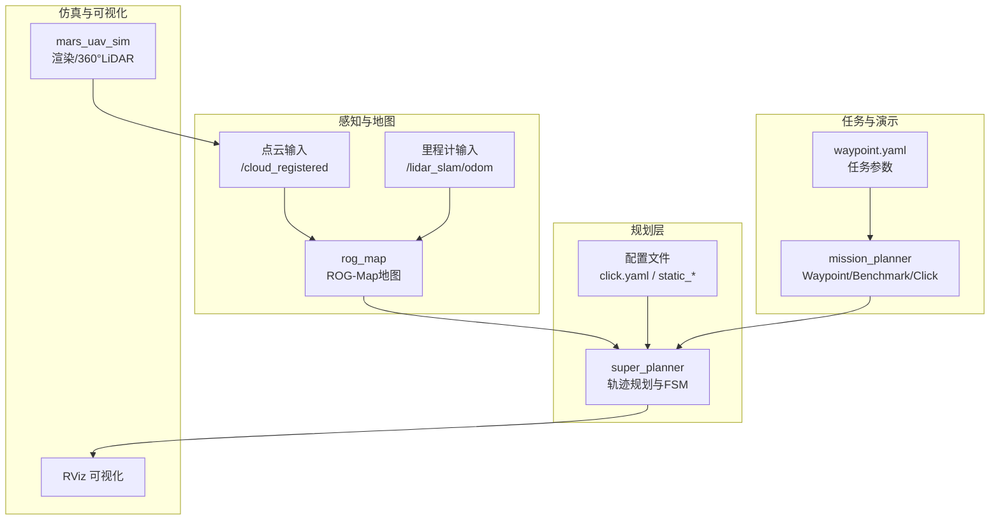
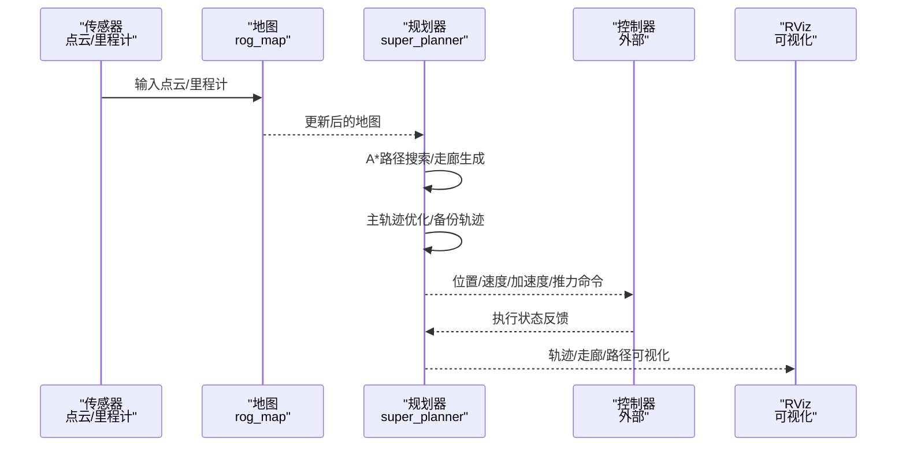
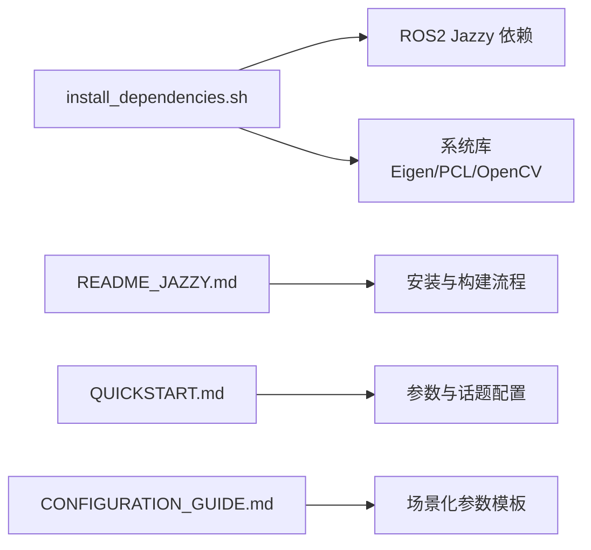

# 应用场景与案例

<cite>
**本文引用的文件**   
- [README.md](file://src/SUPER/README.md)
- [README_zh.md](file://src/SUPER/README_zh.md)
- [README_JAZZY.md](file://src/SUPER/README_JAZZY.md)
- [install_dependencies.sh](file://src/SUPER/install_dependencies.sh)
- [CONFIGURATION_GUIDE.md](file://src/SUPER/super_planner/docs/CONFIGURATION_GUIDE.md)
- [QUICKSTART.md](file://src/SUPER/super_planner/docs/QUICKSTART.md)
- [click.yaml](file://src/SUPER/super_planner/config/click.yaml)
- [static_high_speed.yaml](file://src/SUPER/super_planner/config/static_high_speed.yaml)
- [static_dense.yaml](file://src/SUPER/super_planner/config/static_dense.yaml)
- [waypoint.yaml](file://src/SUPER/mission_planner/config/waypoint.yaml)
</cite>

## 目录
1. [简介](#简介)
2. [项目结构](#项目结构)
3. [核心组件](#核心组件)
4. [架构总览](#架构总览)
5. [详细场景分析](#详细场景分析)
6. [依赖关系分析](#依赖关系分析)
7. [性能考量](#性能考量)
8. [故障排查指南](#故障排查指南)
9. [结论](#结论)
10. [附录](#附录)

## 简介
本章节面向潜在用户，系统化介绍SUPER在真实场景中的应用潜力与落地案例，重点覆盖：
- 大范围自主探索：在开放/未知环境中实现持续导航与目标推进
- 目标跟踪：白天与夜间条件下的稳定跟踪能力
- 复杂环境下的自主飞行：高密度障碍物、狭小走廊、动态/静态场景的稳健性

同时，本节提供视频演示入口与效果示意链接，帮助用户直观理解系统能力；并给出与FAST-LIVO2、尾翼式无人机等项目的结合方式，以及部署与最佳实践建议。

## 项目结构
SUPER采用模块化设计，围绕“规划器（super_planner）+ 地图（rog_map）+ 任务编排（mission_planner）+ 渲染与仿真（mars_uav_sim）”展开。核心模块职责如下：
- super_planner：负责路径搜索、走廊生成、轨迹优化与备份轨迹，提供FSM状态机与ROS接口
- rog_map：基于robocentric occupancy grid的地图表示与更新，支撑大场景与高分辨率需求
- mission_planner：任务编排与演示（Waypoint、Benchmark、Click Demo等）
- mars_uav_sim：渲染与仿真环境，支持360°激光雷达配置与Perfect Drone仿真

**图表来源**
- [click.yaml](file://src/SUPER/super_planner/config/click.yaml#L1-L190)
- [static_high_speed.yaml](file://src/SUPER/super_planner/config/static_high_speed.yaml#L1-L187)
- [static_dense.yaml](file://src/SUPER/super_planner/config/static_dense.yaml#L1-L186)
- [waypoint.yaml](file://src/SUPER/mission_planner/config/waypoint.yaml#L1-L19)

**章节来源**
- [README.md](file://src/SUPER/README.md#L66-L96)
- [README_zh.md](file://src/SUPER/README_zh.md#L67-L96)

## 核心组件
- 规划器（super_planner）
  - 路径搜索：A*，支持启发式类型与网格分辨率配置
  - 走廊生成：基于膨胀与安全边界，形成C-space安全通道
  - 轨迹优化：主轨迹与备份轨迹双优化链路，支持LBFGS与多项式优化
  - 动态参数：支持ROS2动态参数服务，运行时热调
- 地图（rog_map）
  - ROG-Map高效占用栅格，支持概率更新、ESDF、滑窗与虚拟边界
  - 支持外部点云/里程计输入，或通过API更新
- 任务编排（mission_planner）
  - Waypoint任务、Benchmark高/密场景、Click Demo交互式目标设定
- 仿真与可视化（mars_uav_sim）
  - 支持360°激光雷达配置与MARSIM渲染，便于离线验证与演示

**章节来源**
- [CONFIGURATION_GUIDE.md](file://src/SUPER/super_planner/docs/CONFIGURATION_GUIDE.md#L21-L171)
- [QUICKSTART.md](file://src/SUPER/super_planner/docs/QUICKSTART.md#L54-L81)

## 架构总览
SUPER的端到端流程如下：传感器输入（点云/里程计）驱动地图更新；任务/用户目标触发规划器；规划器输出轨迹与命令，经控制器执行；RViz可视化与日志记录贯穿全程。

**图表来源**
- [click.yaml](file://src/SUPER/super_planner/config/click.yaml#L15-L120)
- [static_high_speed.yaml](file://src/SUPER/super_planner/config/static_high_speed.yaml#L37-L105)
- [static_dense.yaml](file://src/SUPER/super_planner/config/static_dense.yaml#L36-L104)

## 详细场景分析

### 场景一：大范围自主探索
- 应用要点
  - 长距离、开放/未知环境下的持续导航
  - 目标推进优先，兼顾安全性与能耗
  - 需要较长规划时间窗与较大感知范围
- 关键配置策略
  - 规划时间窗与感知范围增大，走廊边界与线段长度放宽
  - 吸引力惩罚适度提升，平衡探索效率与安全
  - 备份轨迹分段数增加，非均匀时间分配以提升鲁棒性
- 参考配置
  - [static_high_speed.yaml](file://src/SUPER/super_planner/config/static_high_speed.yaml#L27-L34)（规划时间窗与回收距离）
  - [static_high_speed.yaml](file://src/SUPER/super_planner/config/static_high_speed.yaml#L21-L23)（走廊线段长度）
  - [static_high_speed.yaml](file://src/SUPER/super_planner/config/static_high_speed.yaml#L70-L72)（备份轨迹分段）
- 效果示意
  - 视频演示与效果截图请参考：[README.md](file://src/SUPER/README.md#L74-L81)、[README_zh.md](file://src/SUPER/README_zh.md#L74-L82)

**章节来源**
- [static_high_speed.yaml](file://src/SUPER/super_planner/config/static_high_speed.yaml#L11-L34)
- [static_high_speed.yaml](file://src/SUPER/super_planner/config/static_high_speed.yaml#L69-L87)
- [README.md](file://src/SUPER/README.md#L74-L81)
- [README_zh.md](file://src/SUPER/README_zh.md#L74-L82)

### 场景二：目标跟踪（白天与夜间）
- 应用要点
  - 目标移动时的持续跟踪，要求轨迹平滑、响应迅速
  - 夜间场景强调鲁棒性与稳定性，避免抖动与碰撞
- 关键配置策略
  - 降低时间惩罚权重，提升速度优先；适度提高加加速度惩罚，保证平滑
  - 适当收紧位置约束，减少越障与穿越风险
  - 动态参数在线调整，结合rqt_reconfigure实时观测
- 参考配置
  - [CONFIGURATION_GUIDE.md](file://src/SUPER/super_planner/docs/CONFIGURATION_GUIDE.md#L228-L242)（高速场景参数模板）
  - [CONFIGURATION_GUIDE.md](file://src/SUPER/super_planner/docs/CONFIGURATION_GUIDE.md#L245-L258)（精细避障模板）
  - [QUICKSTART.md](file://src/SUPER/super_planner/docs/QUICKSTART.md#L154-L169)（动态参数回调）
- 效果示意
  - 视频演示与效果截图请参考：[README.md](file://src/SUPER/README.md#L74-L81)、[README_zh.md](file://src/SUPER/README_zh.md#L74-L82)

**章节来源**
- [CONFIGURATION_GUIDE.md](file://src/SUPER/super_planner/docs/CONFIGURATION_GUIDE.md#L228-L258)
- [QUICKSTART.md](file://src/SUPER/super_planner/docs/QUICKSTART.md#L154-L169)
- [README.md](file://src/SUPER/README.md#L74-L81)
- [README_zh.md](file://src/SUPER/README_zh.md#L74-L82)

### 场景三：复杂环境下的自主飞行（高密度/狭小走廊）
- 应用要点
  - 高密度障碍物、狭小走廊、频繁急转与短半径转弯
  - 需要快速响应与高平滑度，避免碰撞与控制饱和
- 关键配置策略
  - 地图分辨率提高，安全边界与膨胀步数加大
  - 主轨迹优化精度与积分分辨率适度降低，提升实时性
  - 备份轨迹启用非均匀时间分配，增强应急避障能力
- 参考配置
  - [static_dense.yaml](file://src/SUPER/super_planner/config/static_dense.yaml#L106-L108)（地图分辨率）
  - [static_dense.yaml](file://src/SUPER/super_planner/config/static_dense.yaml#L108-L109)（膨胀步数）
  - [static_dense.yaml](file://src/SUPER/super_planner/config/static_dense.yaml#L55-L58)（优化精度与积分分辨率）
  - [static_dense.yaml](file://src/SUPER/super_planner/config/static_dense.yaml#L69-L71)（备份轨迹约束类型）
- 效果示意
  - 视频演示与效果截图请参考：[README.md](file://src/SUPER/README.md#L74-L81)、[README_zh.md](file://src/SUPER/README_zh.md#L74-L82)

**章节来源**
- [static_dense.yaml](file://src/SUPER/super_planner/config/static_dense.yaml#L106-L109)
- [static_dense.yaml](file://src/SUPER/super_planner/config/static_dense.yaml#L55-L58)
- [static_dense.yaml](file://src/SUPER/super_planner/config/static_dense.yaml#L69-L71)
- [README.md](file://src/SUPER/README.md#L74-L81)
- [README_zh.md](file://src/SUPER/README_zh.md#L74-L82)

### 与其他项目的结合应用
- FAST-LIVO2（TRO '24）
  - SUPER作为飞行平台与导航系统，配合FAST-LIVO2进行定位与建图
  - 结合演示与说明请参考：[README.md](file://src/SUPER/README.md#L91-L95)、[README_zh.md](file://src/SUPER/README_zh.md#L91-L95)
- 自动尾座式无人机（TRO '25）
  - 基于SUPER的类似规划系统在尾座式无人机上得到验证
  - 结合演示与说明请参考：[README.md](file://src/SUPER/README.md#L85-L90)、[README_zh.md](file://src/SUPER/README_zh.md#L85-L90)

**章节来源**
- [README.md](file://src/SUPER/README.md#L85-L95)
- [README_zh.md](file://src/SUPER/README_zh.md#L85-L95)

## 依赖关系分析
- 系统依赖
  - ROS2（Jazzy/Humble等）与相关消息包、PCL、Eigen、yaml-cpp等
  - 依赖安装脚本与官方安装指南
- 包依赖与构建
  - 支持按包构建（super_planner、rog_map等），并提供自动依赖安装脚本
- 配置与参数
  - YAML配置文件与ROS2动态参数协同，支持运行时热调

**图表来源**
- [install_dependencies.sh](file://src/SUPER/install_dependencies.sh#L1-L71)
- [README_JAZZY.md](file://src/SUPER/README_JAZZY.md#L15-L95)
- [QUICKSTART.md](file://src/SUPER/super_planner/docs/QUICKSTART.md#L14-L51)
- [CONFIGURATION_GUIDE.md](file://src/SUPER/super_planner/docs/CONFIGURATION_GUIDE.md#L226-L288)

**章节来源**
- [install_dependencies.sh](file://src/SUPER/install_dependencies.sh#L1-L71)
- [README_JAZZY.md](file://src/SUPER/README_JAZZY.md#L15-L95)
- [QUICKSTART.md](file://src/SUPER/super_planner/docs/QUICKSTART.md#L14-L51)
- [CONFIGURATION_GUIDE.md](file://src/SUPER/super_planner/docs/CONFIGURATION_GUIDE.md#L226-L288)

## 性能考量
- 实时性与稳定性
  - 路径搜索、走廊生成、轨迹优化的典型耗时在毫秒级，满足高频命令生成需求
  - 通过降低分辨率、优化精度与积分分辨率可在复杂场景提升实时性
- 能耗与轨迹平滑
  - 通过合理设置加加速度惩罚与平滑参数，平衡能耗与轨迹平滑度
- 参数调试流程
  - 建议先用保守参数测试，再逐步优化；使用rqt_reconfigure与RViz可视化辅助调试

**章节来源**
- [QUICKSTART.md](file://src/SUPER/super_planner/docs/QUICKSTART.md#L365-L376)
- [CONFIGURATION_GUIDE.md](file://src/SUPER/super_planner/docs/CONFIGURATION_GUIDE.md#L388-L411)

## 故障排查指南
- 常见问题与对策
  - 轨迹优化失败：检查走廊有效性、适度放松惩罚权重、提升初值质量
  - 轨迹不连续/跳跃：提高加加速度惩罚与平滑参数
  - 规划速度慢：降低分辨率与优化精度、减少积分分辨率
  - 动态参数不生效：核对参数名大小写、确认回调与节点重启
- 调试工具与技巧
  - 启用日志输出、使用RViz查看走廊、录制bag回放分析、rqt_reconfigure实时调参

**章节来源**
- [CONFIGURATION_GUIDE.md](file://src/SUPER/super_planner/docs/CONFIGURATION_GUIDE.md#L325-L385)
- [QUICKSTART.md](file://src/SUPER/super_planner/docs/QUICKSTART.md#L190-L235)

## 结论
SUPER在多种真实场景中展现出卓越的适应性与鲁棒性，尤其在大范围探索、目标跟踪与复杂环境飞行方面具备显著优势。通过合理的参数配置与动态调参，用户可以在不同任务中取得良好性能。结合FAST-LIVO2与尾翼式无人机等项目，SUPER进一步拓展了在多传感器融合与多样化平台上的应用空间。

## 附录
- 快速开始与演示
  - 高速导航、密集环境敏捷飞行、点击演示等启动方式与参数模板
- 任务编排
  - Waypoint任务参数与触发机制，支持路径/航点两种命令类型
- 日志与可视化
  - 规划日志、轨迹可视化、RViz配置与bag录制回放

**章节来源**
- [README.md](file://src/SUPER/README.md#L143-L201)
- [README_zh.md](file://src/SUPER/README_zh.md#L141-L170)
- [waypoint.yaml](file://src/SUPER/mission_planner/config/waypoint.yaml#L1-L19)
- [click.yaml](file://src/SUPER/super_planner/config/click.yaml#L1-L190)
- [static_high_speed.yaml](file://src/SUPER/super_planner/config/static_high_speed.yaml#L1-L187)
- [static_dense.yaml](file://src/SUPER/super_planner/config/static_dense.yaml#L1-L186)