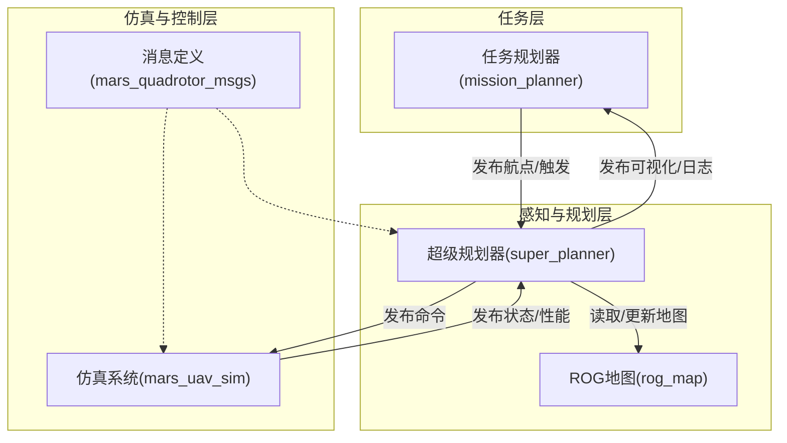
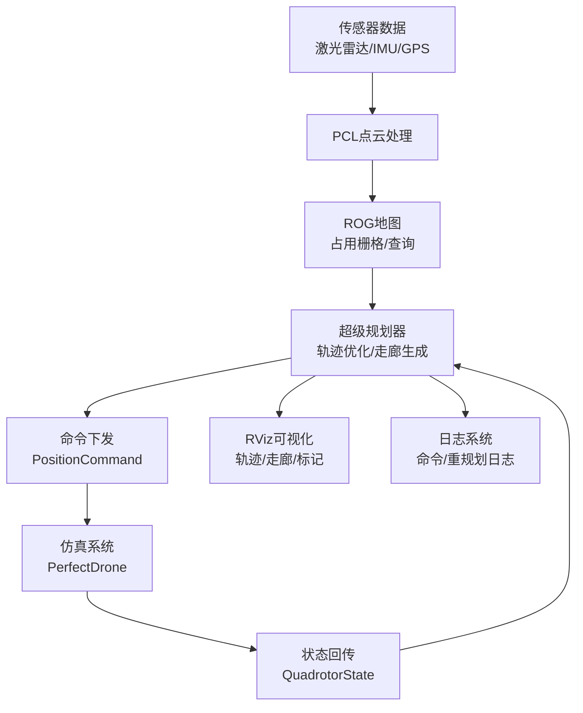
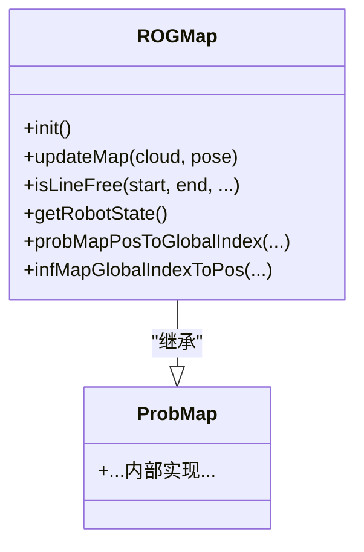
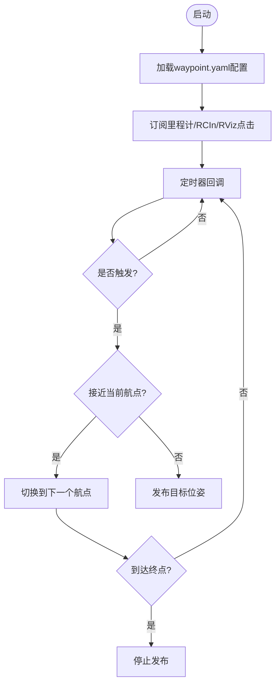
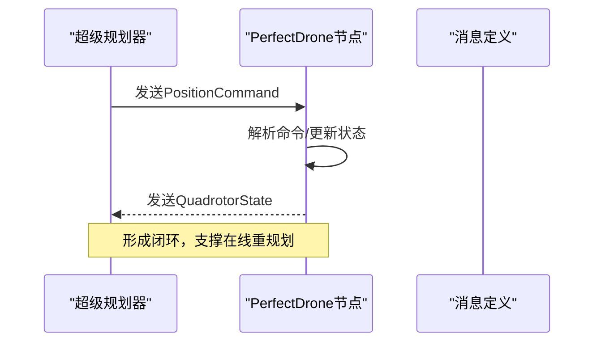
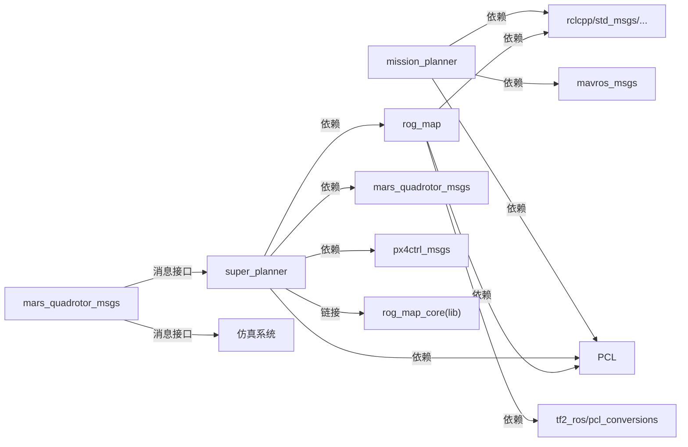

# 技术架构概览

<cite>
**本文档引用的文件**
- [README.md](file://src/SUPER/README.md)
- [README_zh.md](file://src/SUPER/README_zh.md)
- [super_planner/package.xml](file://src/SUPER/super_planner/package.xml)
- [rog_map/package.xml](file://src/SUPER/rog_map/package.xml)
- [mission_planner/package.xml](file://src/SUPER/mission_planner/package.xml)
- [mars_quadrotor_msgs/package.xml](file://src/SUPER/mars_uav_sim/mars_quadrotor_msgs/package.xml)
- [super_planner/include/super_core/super_planner.h](file://src/SUPER/super_planner/include/super_core/super_planner.h)
- [rog_map/include/rog_map/rog_map.h](file://src/SUPER/rog_map/include/rog_map/rog_map.h)
- [mission_planner/include/waypoint_mission/ros2_waypoint_planner.hpp](file://src/SUPER/mission_planner/include/waypoint_mission/ros2_waypoint_planner.hpp)
- [mars_uav_sim/perfect_drone_sim/src/ros2_perfect_drone_node.cpp](file://src/SUPER/mars_uav_sim/perfect_drone_sim/src/ros2_perfect_drone_node.cpp)
- [mars_uav_sim/mars_quadrotor_msgs/ros2_msg/QuadrotorState.msg](file://src/SUPER/mars_uav_sim/mars_quadrotor_msgs/ros2_msg/QuadrotorState.msg)
- [mars_uav_sim/mars_quadrotor_msgs/ros2_msg/PositionCommand.msg](file://src/SUPER/mars_uav_sim/mars_quadrotor_msgs/ros2_msg/PositionCommand.msg)
- [super_planner/include/super_core/config.hpp](file://src/SUPER/super_planner/include/super_core/config.hpp)
- [super_planner/CMakeLists.txt](file://src/SUPER/super_planner/CMakeLists.txt)
- [rog_map/CMakeLists.txt](file://src/SUPER/rog_map/CMakeLists.txt)
- [mission_planner/config/waypoint.yaml](file://src/SUPER/mission_planner/config/waypoint.yaml)
</cite>

## 目录
1. [引言](#引言)
2. [项目结构](#项目结构)
3. [核心组件](#核心组件)
4. [架构总览](#架构总览)
5. [详细组件分析](#详细组件分析)
6. [依赖关系分析](#依赖关系分析)
7. [性能考虑](#性能考虑)
8. [故障排查指南](#故障排查指南)
9. [结论](#结论)
10. [附录](#附录)

## 引言
本文件面向架构师与高级开发者，系统化梳理SUPER项目的整体技术架构与模块关系。SUPER围绕“安全高速飞行”的核心目标，采用模块化设计，将系统拆分为四大核心模块：超级规划器、ROG地图系统、任务规划器、仿真系统。系统通过ROS2统一调度，结合Eigen、PCL、GLFW/GLAD/GLM等关键技术栈，形成从底层传感器数据到上层任务决策的完整链路。本文将重点阐述模块职责、数据流、并发与实时性保障、可扩展性设计及关键技术选型理由，并提供架构图与组件关系图辅助理解。

## 项目结构
SUPER采用按功能域划分的包结构，每个模块独立成包，通过ROS2接口耦合，便于独立开发、测试与演进：
- super_planner：超级规划器核心，负责轨迹优化、路径搜索、走廊生成与命令下发
- rog_map：ROG地图系统，负责占用栅格地图构建、更新与查询
- mission_planner：任务规划器，负责航点任务编排与可视化
- mars_uav_sim：仿真系统，包含理想无人机模型与渲染组件
- 各模块均提供ROS2接口与消息定义，便于跨模块通信



图表来源
- [super_planner/package.xml](file://src/SUPER/super_planner/package.xml#L1-L21)
- [rog_map/package.xml](file://src/SUPER/rog_map/package.xml#L1-L27)
- [mission_planner/package.xml](file://src/SUPER/mission_planner/package.xml#L1-L19)
- [mars_quadrotor_msgs/package.xml](file://src/SUPER/mars_uav_sim/mars_quadrotor_msgs/package.xml#L1-L26)

章节来源
- [README.md](file://src/SUPER/README.md#L96-L200)
- [README_zh.md](file://src/SUPER/README_zh.md#L97-L165)

## 核心组件
- 超级规划器（super_planner）
  - 职责：轨迹优化、路径搜索、安全走廊生成、命令合成与下发、参数动态更新、日志与性能统计
  - 关键接口：PlanFromRest/ReplanOnce、getOneCommandFromTraj、updateRuntimeParams、getLatestReplanLog
  - 依赖：ROG地图、轨迹优化器、路径搜索器、ROS2接口
- ROG地图系统（rog_map）
  - 职责：概率占用栅格地图构建、线段连通性检测、最近单元查询、地图更新与状态维护
  - 关键接口：isLineFree、updateMap、getRobotState、pos/idx互转
- 任务规划器（mission_planner）
  - 职责：航点任务编排、RViz交互触发、Mavros遥控触发、定时发布目标位姿
  - 关键接口：WaypointPlanner回调与定时器、可视化标记发布
- 仿真系统（mars_uav_sim）
  - 职责：理想无人机动力学仿真、状态回传、渲染与可视化
  - 关键接口：PerfectDrone节点、状态消息与命令消息

章节来源
- [super_planner/include/super_core/super_planner.h](file://src/SUPER/super_planner/include/super_core/super_planner.h#L59-L296)
- [rog_map/include/rog_map/rog_map.h](file://src/SUPER/rog_map/include/rog_map/rog_map.h#L39-L131)
- [mission_planner/include/waypoint_mission/ros2_waypoint_planner.hpp](file://src/SUPER/mission_planner/include/waypoint_mission/ros2_waypoint_planner.hpp#L24-L410)
- [mars_uav_sim/perfect_drone_sim/src/ros2_perfect_drone_node.cpp](file://src/SUPER/mars_uav_sim/perfect_drone_sim/src/ros2_perfect_drone_node.cpp#L1-L11)

## 架构总览
SUPER采用分层架构，自下而上为：
- 传感器数据层：激光雷达点云、IMU、GPS等（经由PCL与ROS2接口进入系统）
- 地图与感知层：ROG地图负责占用栅格建模与查询
- 规划与控制层：超级规划器进行轨迹优化与走廊生成，任务规划器负责航点与触发
- 仿真与可视化层：仿真系统模拟飞行器状态，RViz进行可视化展示



图表来源
- [mars_uav_sim/mars_quadrotor_msgs/ros2_msg/PositionCommand.msg](file://src/SUPER/mars_uav_sim/mars_quadrotor_msgs/ros2_msg/PositionCommand.msg#L1-L30)
- [mars_uav_sim/mars_quadrotor_msgs/ros2_msg/QuadrotorState.msg](file://src/SUPER/mars_uav_sim/mars_quadrotor_msgs/ros2_msg/QuadrotorState.msg#L1-L11)
- [super_planner/include/super_core/super_planner.h](file://src/SUPER/super_planner/include/super_core/super_planner.h#L226-L234)

## 详细组件分析

### 超级规划器（SuperPlanner）
- 设计要点
  - 模块化：轨迹优化器、路径搜索器、走廊生成器、FOV检查器、ROS接口解耦
  - 并发与锁：使用互斥量保护共享状态（如承诺轨迹、重规划锁）
  - 动态参数：支持运行时参数热更新，同步至轨迹优化器动态配置
  - 性能统计：记录前后端处理耗时，支持平均值统计
- 数据流
  - 输入：点云与位姿（更新地图）、目标位姿与偏航、机器人状态
  - 处理：路径搜索、走廊生成、轨迹优化（探索/备份）、命令合成
  - 输出：位置/偏航轨迹、命令（PositionCommand）、可视化标记、日志
- 关键流程（重规划序列）

```mermaid
sequenceDiagram
participant MP as "任务规划器"
participant SP as "超级规划器"
participant RM as "ROG地图"
participant OPT as "轨迹优化器"
participant SIM as "仿真系统"
MP->>SP : 发布目标位姿/触发信号
SP->>RM : updateMap(点云, 位姿)
SP->>SP : 路径搜索/走廊生成
SP->>OPT : 生成探索轨迹/备份轨迹
OPT-->>SP : 返回优化结果
SP->>SP : 命令合成(getOneCommandFromTraj)
SP-->>MP : 可视化/日志
SP->>SIM : 发送PositionCommand
SIM-->>SP : 回传QuadrotorState
```

图表来源
- [super_planner/include/super_core/super_planner.h](file://src/SUPER/super_planner/include/super_core/super_planner.h#L139-L146)
- [super_planner/include/super_core/super_planner.h](file://src/SUPER/super_planner/include/super_core/super_planner.h#L226-L234)
- [mars_uav_sim/mars_quadrotor_msgs/ros2_msg/PositionCommand.msg](file://src/SUPER/mars_uav_sim/mars_quadrotor_msgs/ros2_msg/PositionCommand.msg#L1-L30)
- [mars_uav_sim/mars_quadrotor_msgs/ros2_msg/QuadrotorState.msg](file://src/SUPER/mars_uav_sim/mars_quadrotor_msgs/ros2_msg/QuadrotorState.msg#L1-L11)

章节来源
- [super_planner/include/super_core/super_planner.h](file://src/SUPER/super_planner/include/super_core/super_planner.h#L104-L296)
- [super_planner/include/super_core/config.hpp](file://src/SUPER/super_planner/include/super_core/config.hpp#L44-L235)

### ROG地图系统（ROGMap）
- 设计要点
  - 基于概率占用栅格与滑动窗口的高效地图表示
  - 提供线段连通性检测、最近单元查询、坐标与索引转换
  - 支持地图更新与机器人状态维护
- 数据结构与复杂度
  - 地图存储：占用概率与自由计数，查询复杂度与分辨率、搜索半径相关
  - 线段检测：Raycasting/种子线策略，复杂度与障碍密度相关
- 关键接口
  - isLineFree：判断两点间连通性，支持返回自由目标点
  - updateMap：增量更新地图
  - getRobotState/pos/idx互转：地图与机器人状态交互



图表来源
- [rog_map/include/rog_map/rog_map.h](file://src/SUPER/rog_map/include/rog_map/rog_map.h#L39-L131)

章节来源
- [rog_map/include/rog_map/rog_map.h](file://src/SUPER/rog_map/include/rog_map/rog_map.h#L39-L131)

### 任务规划器（WaypointPlanner）
- 设计要点
  - 支持RViz点击触发与Mavros遥控触发
  - 定时器驱动目标发布，支持航点切换阈值与超时检测
  - 可视化：航点路径、切换半径、ID标注
- 并发与回调组
  - 为不同回调创建互斥回调组，避免竞争与阻塞
- 参数与配置
  - 通过waypoint.yaml配置目标话题、里程计话题、触发方式、切换阈值、发布周期等



图表来源
- [mission_planner/include/waypoint_mission/ros2_waypoint_planner.hpp](file://src/SUPER/mission_planner/include/waypoint_mission/ros2_waypoint_planner.hpp#L52-L160)
- [mission_planner/config/waypoint.yaml](file://src/SUPER/mission_planner/config/waypoint.yaml#L1-L19)

章节来源
- [mission_planner/include/waypoint_mission/ros2_waypoint_planner.hpp](file://src/SUPER/mission_planner/include/waypoint_mission/ros2_waypoint_planner.hpp#L24-L410)
- [mission_planner/config/waypoint.yaml](file://src/SUPER/mission_planner/config/waypoint.yaml#L1-L19)

### 仿真系统（PerfectDrone）
- 设计要点
  - PerfectDrone节点作为ROS2节点，处理命令并回传状态
  - 与消息定义配合，实现命令-状态闭环
- 典型流程



图表来源
- [mars_uav_sim/perfect_drone_sim/src/ros2_perfect_drone_node.cpp](file://src/SUPER/mars_uav_sim/perfect_drone_sim/src/ros2_perfect_drone_node.cpp#L1-L11)
- [mars_uav_sim/mars_quadrotor_msgs/ros2_msg/PositionCommand.msg](file://src/SUPER/mars_uav_sim/mars_quadrotor_msgs/ros2_msg/PositionCommand.msg#L1-L30)
- [mars_uav_sim/mars_quadrotor_msgs/ros2_msg/QuadrotorState.msg](file://src/SUPER/mars_uav_sim/mars_quadrotor_msgs/ros2_msg/QuadrotorState.msg#L1-L11)

## 依赖关系分析
- 包依赖
  - super_planner依赖rog_map、mars_quadrotor_msgs、px4ctrl_msgs、PCL、ROS2接口
  - rog_map依赖PCL、tf2_ros、pcl_conversions、ROS2接口
  - mission_planner依赖mavros_msgs、PCL、ROS2接口
  - mars_quadrotor_msgs提供标准消息接口，供其他模块复用
- 编译与链接
  - CMakeLists中明确find_package与ament_target_dependencies，确保ROS2生态兼容
  - super_planner显式链接rog_map_core库，保证模块内聚与接口稳定



图表来源
- [super_planner/package.xml](file://src/SUPER/super_planner/package.xml#L8-L15)
- [rog_map/package.xml](file://src/SUPER/rog_map/package.xml#L12-L22)
- [mission_planner/package.xml](file://src/SUPER/mission_planner/package.xml#L8-L13)
- [mars_quadrotor_msgs/package.xml](file://src/SUPER/mars_uav_sim/mars_quadrotor_msgs/package.xml#L10-L20)
- [super_planner/CMakeLists.txt](file://src/SUPER/super_planner/CMakeLists.txt#L109-L125)
- [rog_map/CMakeLists.txt](file://src/SUPER/rog_map/CMakeLists.txt#L73-L87)

章节来源
- [super_planner/package.xml](file://src/SUPER/super_planner/package.xml#L1-L21)
- [rog_map/package.xml](file://src/SUPER/rog_map/package.xml#L1-L27)
- [mission_planner/package.xml](file://src/SUPER/mission_planner/package.xml#L1-L19)
- [mars_quadrotor_msgs/package.xml](file://src/SUPER/mars_uav_sim/mars_quadrotor_msgs/package.xml#L1-L26)
- [super_planner/CMakeLists.txt](file://src/SUPER/super_planner/CMakeLists.txt#L33-L74)
- [rog_map/CMakeLists.txt](file://src/SUPER/rog_map/CMakeLists.txt#L29-L66)

## 性能考虑
- 实时性与并发
  - 任务规划器使用定时器与互斥回调组，避免阻塞；超级规划器内部使用互斥量保护共享状态，减少锁粒度争用
  - 轨迹优化与路径搜索采用分阶段处理，结合采样步长与规划时域，平衡实时性与安全性
- 优化与可扩展性
  - 参数热更新：支持运行时动态调整轨迹边界、惩罚项与算法配置，无需重启
  - 模块解耦：地图、规划、仿真通过消息与接口解耦，便于替换与扩展
- 关键技术栈
  - ROS2：统一调度、消息总线、参数服务器与可视化生态
  - Eigen：高效矩阵/向量运算，支撑轨迹与几何计算
  - PCL：点云处理与占用栅格构建
  - GLFW/GLAD/GLM：仿真渲染与可视化
  - YAML：参数配置与离线调参

章节来源
- [super_planner/include/super_core/super_planner.h](file://src/SUPER/super_planner/include/super_core/super_planner.h#L76-L84)
- [super_planner/include/super_core/config.hpp](file://src/SUPER/super_planner/include/super_core/config.hpp#L158-L228)
- [README.md](file://src/SUPER/README.md#L100-L112)
- [README_zh.md](file://src/SUPER/README_zh.md#L101-L113)

## 故障排查指南
- 构建与依赖
  - 确认Eigen软链接与PCL、ROS2依赖安装正确
  - 使用colcon构建，关注rog_map_core库链接失败问题
- 运行与参数
  - 使用waypoint.yaml配置目标/里程计话题与触发方式
  - 若出现“里程计超时”，检查订阅话题与频率
- 地图与坐标
  - ROG-Map默认假设输入点云在世界坐标系，若使用自定义仿真或非FAST-LIO2里程计，需确保点云与位姿在世界帧
- 日志与可视化
  - 查看命令与重规划日志目录，使用Python脚本绘制轨迹质量指标

章节来源
- [README.md](file://src/SUPER/README.md#L100-L112)
- [README.md](file://src/SUPER/README.md#L217-L239)
- [README_zh.md](file://src/SUPER/README_zh.md#L101-L113)
- [README_zh.md](file://src/SUPER/README_zh.md#L182-L204)
- [README.md](file://src/SUPER/README.md#L245-L247)

## 结论
SUPER通过清晰的模块划分与ROS2生态集成，实现了从感知到规划再到仿真的完整链路。ROG地图提供高效的空间表征，超级规划器承担核心算法与控制命令生成，任务规划器负责任务编排与可视化，仿真系统提供闭环验证能力。模块化设计与参数热更新提升了系统的可扩展性与工程适应性，适合在真实硬件与仿真环境中持续演进。

## 附录
- 关键消息类型
  - PositionCommand：位置/速度/加速度/急动度、姿态/角速度、推力、轨迹标志等
  - QuadrotorState：推力/速度/加速度/急动度范数、位置/速度/加速度/.snap、姿态/角速度
- 启动与测试
  - 提供benchmark与click_demo示例，支持高/密集环境与交互式演示

章节来源
- [mars_uav_sim/mars_quadrotor_msgs/ros2_msg/PositionCommand.msg](file://src/SUPER/mars_uav_sim/mars_quadrotor_msgs/ros2_msg/PositionCommand.msg#L1-L30)
- [mars_uav_sim/mars_quadrotor_msgs/ros2_msg/QuadrotorState.msg](file://src/SUPER/mars_uav_sim/mars_quadrotor_msgs/ros2_msg/QuadrotorState.msg#L1-L11)
- [README.md](file://src/SUPER/README.md#L143-L200)
- [README_zh.md](file://src/SUPER/README_zh.md#L141-L165)