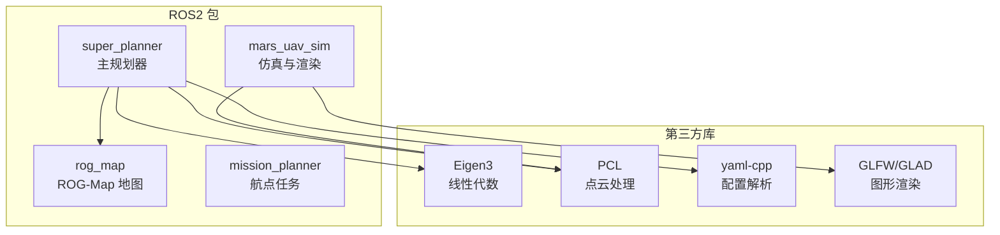
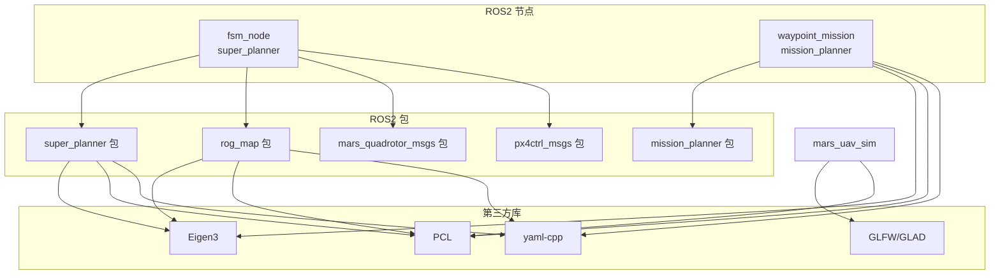
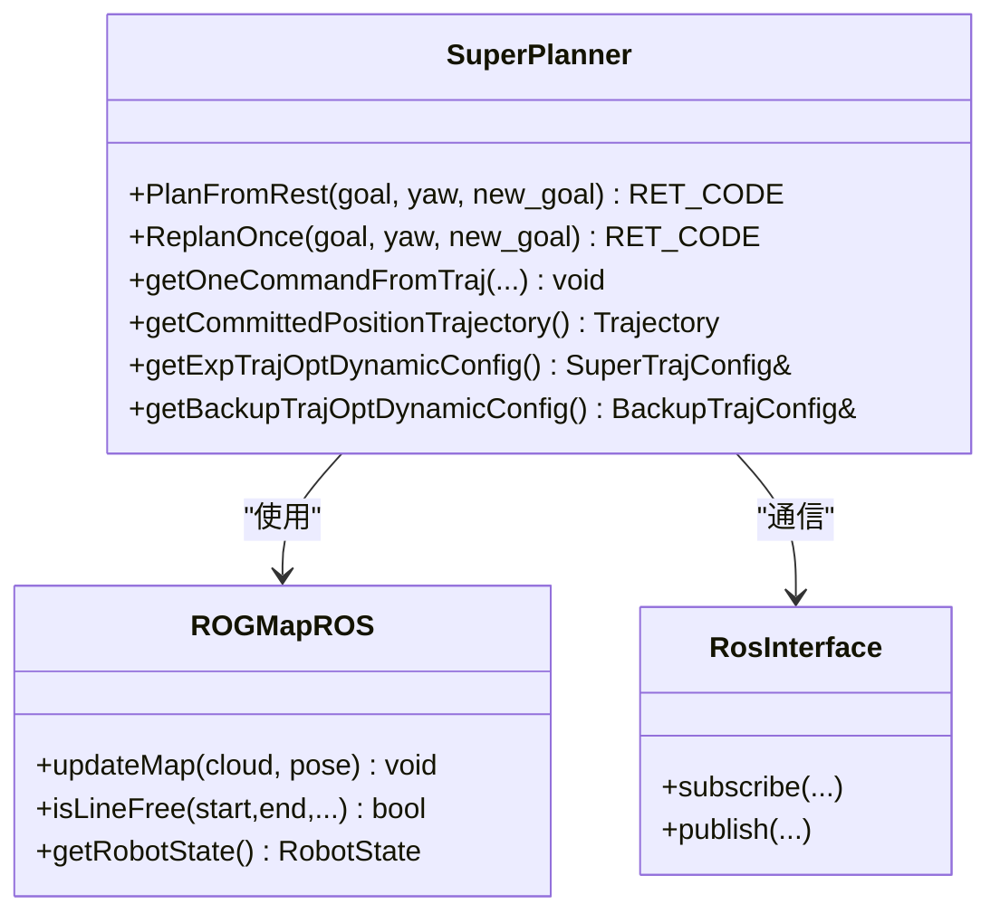
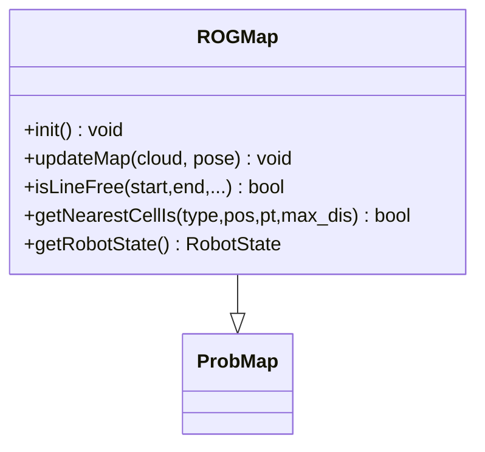
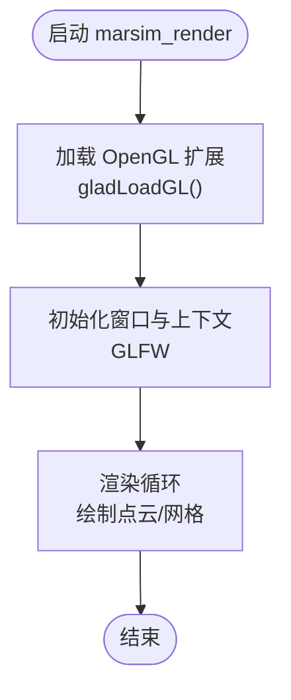
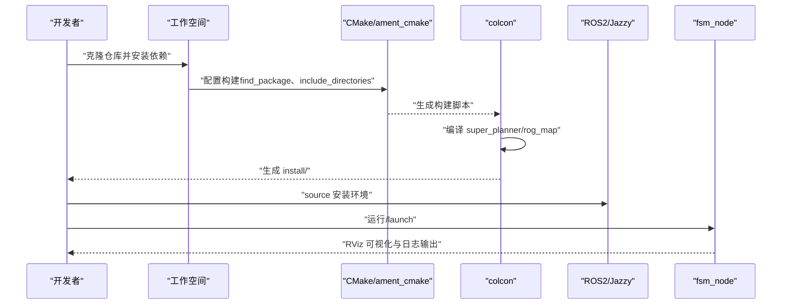
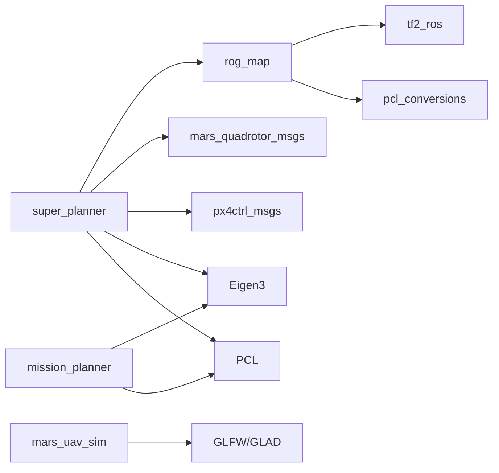

# 技术栈与依赖

<cite>
**本文引用的文件**
- [README.md](file://README.md)
- [install_dependencies.sh](file://src/SUPER/install_dependencies.sh)
- [super_planner/CMakeLists.txt](file://src/SUPER/super_planner/CMakeLists.txt)
- [mission_planner/CMakeLists.txt](file://src/SUPER/mission_planner/CMakeLists.txt)
- [rog_map/CMakeLists.txt](file://src/SUPER/rog_map/CMakeLists.txt)
- [super_planner/package.xml](file://src/SUPER/super_planner/package.xml)
- [rog_map/package.xml](file://src/SUPER/rog_map/package.xml)
- [mars_quadrotor_msgs/package.xml](file://src/SUPER/mars_uav_sim/mars_quadrotor_msgs/package.xml)
- [px4ctrl_msgs/package.xml](file://src/SUPER/mars_uav_sim/px4ctrl_msgs/package.xml)
- [super_planner/include/super_core/super_planner.h](file://src/SUPER/super_planner/include/super_core/super_planner.h)
- [rog_map/include/rog_map/rog_map.h](file://src/SUPER/rog_map/include/rog_map/rog_map.h)
- [marsim_render/include/glad/glad.h](file://src/SUPER/mars_uav_sim/marsim_render/include/glad/glad.h)
- [super_planner/docs/QUICKSTART.md](file://src/SUPER/super_planner/docs/QUICKSTART.md)
</cite>

## 目录
1. [简介](#简介)
2. [项目结构](#项目结构)
3. [核心组件](#核心组件)
4. [架构总览](#架构总览)
5. [详细组件分析](#详细组件分析)
6. [依赖关系分析](#依赖关系分析)
7. [性能考量](#性能考量)
8. [故障排查指南](#故障排查指南)
9. [结论](#结论)
10. [附录](#附录)

## 简介
本文件为 SUPER 项目的“技术栈与依赖”概览，聚焦于项目采用的核心技术与第三方依赖，包括：
- 机器人操作系统：ROS2（Jazzy）
- 数值与线性代数：Eigen3
- 图形渲染与窗口：GLFW、OpenGL（通过 glad）、GLAD
- 点云处理：PCL（Point Cloud Library）
- 配置与序列化：yaml-cpp
- 构建系统：CMake + ament_cmake
- 开发工具链：colcon、rosdep、RViz2、rqt_reconfigure、ros2 bag
- 许可证：BSD（super_planner、rog_map），Apache 2.0（mars_quadrotor_msgs），GPLv3（px4ctrl_msgs）

本文件还提供版本兼容性、推荐配置、安装与构建步骤、开发与调试建议，以及常见问题解决方案。

## 项目结构
项目采用按功能域划分的多包结构，核心模块包括：
- super_planner：主规划器与轨迹优化
- rog_map：ROG-Map 多层占用栅格地图
- mission_planner：航点任务规划
- mars_uav_sim：多旋翼仿真与渲染（含自研消息类型）
- 安装脚本与文档：统一依赖安装与使用说明

图表来源
- [super_planner/CMakeLists.txt](file://src/SUPER/super_planner/CMakeLists.txt#L33-L44)
- [rog_map/CMakeLists.txt](file://src/SUPER/rog_map/CMakeLists.txt#L29-L37)
- [mission_planner/CMakeLists.txt](file://src/SUPER/mission_planner/CMakeLists.txt#L26-L37)
- [install_dependencies.sh](file://src/SUPER/install_dependencies.sh#L27-L51)

章节来源
- [README.md](file://README.md#L1-L168)
- [super_planner/CMakeLists.txt](file://src/SUPER/super_planner/CMakeLists.txt#L1-L188)
- [rog_map/CMakeLists.txt](file://src/SUPER/rog_map/CMakeLists.txt#L1-L114)
- [mission_planner/CMakeLists.txt](file://src/SUPER/mission_planner/CMakeLists.txt#L1-L109)

## 核心组件
- ROS2 适配与构建
  - 使用 ament_cmake 作为构建系统，C++17 标准，支持 Debug/Release 构建选项
  - 通过 find_package(...) 引入 rclcpp、std_msgs、sensor_msgs、geometry_msgs、nav_msgs、visualization_msgs、tf2_ros、pcl_conversions、PCL、yaml-cpp 等
- 数值与线性代数：Eigen3
  - 在头文件中显式包含 <Eigen/Eigen> 并使用 aligned allocator
- 点云处理：PCL
  - 在 super_planner 与 rog_map 中广泛使用，包含 PCL_LIBRARIES、PCL_INCLUDE_DIRS
- 图形渲染：GLFW/GLAD
  - marsim_render 内嵌 glad 头文件，提供 OpenGL 加载器；同时安装 libglfw3-dev、libglew-dev
- 配置与序列化：yaml-cpp
  - 作为 third_party_libs 链接，用于读取 YAML 参数
- 自定义消息与服务
  - mars_quadrotor_msgs（Apache 2.0）与 px4ctrl_msgs（GPLv3）分别提供多旋翼与 PX4 控制相关消息与服务

章节来源
- [super_planner/CMakeLists.txt](file://src/SUPER/super_planner/CMakeLists.txt#L4-L15)
- [super_planner/CMakeLists.txt](file://src/SUPER/super_planner/CMakeLists.txt#L33-L44)
- [rog_map/CMakeLists.txt](file://src/SUPER/rog_map/CMakeLists.txt#L29-L37)
- [mission_planner/CMakeLists.txt](file://src/SUPER/mission_planner/CMakeLists.txt#L36-L37)
- [install_dependencies.sh](file://src/SUPER/install_dependencies.sh#L27-L51)
- [super_planner/include/super_core/super_planner.h](file://src/SUPER/super_planner/include/super_core/super_planner.h#L28-L33)
- [mars_quadrotor_msgs/package.xml](file://src/SUPER/mars_uav_sim/mars_quadrotor_msgs/package.xml#L1-L26)
- [px4ctrl_msgs/package.xml](file://src/SUPER/mars_uav_sim/px4ctrl_msgs/package.xml#L1-L22)

## 架构总览
下图展示 SUPER 在 ROS2 环境下的模块交互与依赖关系：

图表来源
- [super_planner/CMakeLists.txt](file://src/SUPER/super_planner/CMakeLists.txt#L61-L74)
- [mission_planner/CMakeLists.txt](file://src/SUPER/mission_planner/CMakeLists.txt#L54-L62)
- [rog_map/CMakeLists.txt](file://src/SUPER/rog_map/CMakeLists.txt#L57-L65)
- [super_planner/package.xml](file://src/SUPER/super_planner/package.xml#L8-L15)
- [rog_map/package.xml](file://src/SUPER/rog_map/package.xml#L12-L18)
- [mars_quadrotor_msgs/package.xml](file://src/SUPER/mars_uav_sim/mars_quadrotor_msgs/package.xml#L10-L16)
- [px4ctrl_msgs/package.xml](file://src/SUPER/mars_uav_sim/px4ctrl_msgs/package.xml#L10-L16)

## 详细组件分析

### 组件一：super_planner（主规划器）
- 职责
  - 整合路径搜索、走廊生成、轨迹优化与备份轨迹策略
  - 提供 ROS2 接口与可视化输出（RViz）
- 关键特性
  - 使用 Eigen3 进行数值计算与对齐内存分配
  - 依赖 PCL 进行点云处理与地图更新
  - 通过 yaml-cpp 解析配置参数
  - 与 rog_map、自定义消息包交互
- 代码级关系示意

图表来源
- [super_planner/include/super_core/super_planner.h](file://src/SUPER/super_planner/include/super_core/super_planner.h#L59-L200)
- [rog_map/include/rog_map/rog_map.h](file://src/SUPER/rog_map/include/rog_map/rog_map.h#L39-L131)

章节来源
- [super_planner/include/super_core/super_planner.h](file://src/SUPER/super_planner/include/super_core/super_planner.h#L28-L53)
- [super_planner/CMakeLists.txt](file://src/SUPER/super_planner/CMakeLists.txt#L101-L115)

### 组件二：rog_map（ROG-Map 地图）
- 职责
  - 多层占用栅格地图表示（概率、自由、未知、膨胀等）
  - 提供线段可视性检查、最近障碍查询等接口
- 关键特性
  - 基于 PCL 的点云输入与坐标转换
  - 与 tf2_ros、pcl_conversions、yaml-cpp 集成
- 类关系示意

图表来源
- [rog_map/include/rog_map/rog_map.h](file://src/SUPER/rog_map/include/rog_map/rog_map.h#L39-L131)

章节来源
- [rog_map/include/rog_map/rog_map.h](file://src/SUPER/rog_map/include/rog_map/rog_map.h#L26-L56)
- [rog_map/CMakeLists.txt](file://src/SUPER/rog_map/CMakeLists.txt#L71-L87)

### 组件三：mars_uav_sim（仿真与渲染）
- 职责
  - 提供多旋翼仿真模型与渲染（含自研消息）
  - 使用 OpenGL（glad）进行图形渲染
- 关键特性
  - 内嵌 glad 头文件，提供 OpenGL 加载器
  - 依赖 PCL、GLFW、GLEW 等系统库

图表来源
- [marsim_render/include/glad/glad.h](file://src/SUPER/mars_uav_sim/marsim_render/include/glad/glad.h#L83-L85)

章节来源
- [install_dependencies.sh](file://src/SUPER/install_dependencies.sh#L37-L38)
- [marsim_render/include/glad/glad.h](file://src/SUPER/mars_uav_sim/marsim_render/include/glad/glad.h#L1-L50)

### 组件四：构建与运行流程（Sequence）

图表来源
- [README.md](file://README.md#L75-L95)
- [super_planner/CMakeLists.txt](file://src/SUPER/super_planner/CMakeLists.txt#L33-L44)
- [super_planner/docs/QUICKSTART.md](file://src/SUPER/super_planner/docs/QUICKSTART.md#L7-L23)

## 依赖关系分析
- 包间依赖
  - super_planner 依赖 rog_map、自定义消息包（mars_quadrotor_msgs、px4ctrl_msgs）
  - mission_planner 依赖 rclcpp、PCL、Eigen3
  - rog_map 依赖 PCL、tf2_ros、pcl_conversions、rosidl 接口生成
- 第三方库依赖
  - Eigen3、PCL、yaml-cpp、GLFW/GLAD、OpenGL 扩展（glad）
- 构建系统
  - ament_cmake、CMake ≥ 3.5、C++17

图表来源
- [super_planner/package.xml](file://src/SUPER/super_planner/package.xml#L8-L15)
- [rog_map/package.xml](file://src/SUPER/rog_map/package.xml#L12-L18)
- [mission_planner/CMakeLists.txt](file://src/SUPER/mission_planner/CMakeLists.txt#L36-L37)
- [super_planner/CMakeLists.txt](file://src/SUPER/super_planner/CMakeLists.txt#L43-L44)

章节来源
- [super_planner/package.xml](file://src/SUPER/super_planner/package.xml#L1-L21)
- [rog_map/package.xml](file://src/SUPER/rog_map/package.xml#L1-L27)
- [mars_quadrotor_msgs/package.xml](file://src/SUPER/mars_uav_sim/mars_quadrotor_msgs/package.xml#L1-L26)
- [px4ctrl_msgs/package.xml](file://src/SUPER/mars_uav_sim/px4ctrl_msgs/package.xml#L1-L22)

## 性能考量
- 构建优化
  - Release 模式默认开启 -O3，建议在生产环境使用
  - 可通过 CMake 参数启用 Debug 符号与断言
- 规划性能
  - 路径搜索、走廊生成、轨迹优化的时间开销在文档中有典型范围，便于调参与监控
- 可视化与日志
  - RViz2 与 rqt_reconfigure 有助于实时观测与参数调节
  - 日志系统支持保存与回放分析

章节来源
- [super_planner/CMakeLists.txt](file://src/SUPER/super_planner/CMakeLists.txt#L15-L16)
- [super_planner/docs/QUICKSTART.md](file://src/SUPER/super_planner/docs/QUICKSTART.md#L365-L376)

## 故障排查指南
- 常见问题
  - 包未找到：确保已 source 安装环境
  - 构建错误：确认依赖安装齐全且 ROS2 发行版匹配
  - 权限错误：检查工作空间目录权限
- 调试技巧
  - 启用 DEBUG 日志级别
  - 使用 rqt_reconfigure 实时调整参数
  - 使用 ros2 bag 记录轨迹话题以离线分析
- 典型场景
  - 无路径：检查目标可达性与地图分辨率
  - 轨迹碰撞：增大膨胀步数或提高惩罚权重
  - 规划过慢：降低分辨率或放宽搜索时间

章节来源
- [README.md](file://README.md#L132-L152)
- [super_planner/docs/QUICKSTART.md](file://src/SUPER/super_planner/docs/QUICKSTART.md#L190-L304)

## 结论
SUPER 项目围绕 ROS2 Jazzy 构建，结合 Eigen3、PCL、yaml-cpp 与 OpenGL 渲染栈，形成一套完整的高鲁棒性无人机轨迹规划与地图系统。通过清晰的包结构与完善的构建配置，开发者可以快速搭建环境、开展二次开发，并借助 RViz2、rqt_reconfigure 与日志系统进行高效调试与优化。

## 附录

### 版本兼容性与推荐配置
- 操作系统与发行版
  - Ubuntu 24.04 LTS
- ROS2 发行版
  - Jazzy Jalisco（默认 FastDDS）
- 编译器与标准
  - C++17 兼容编译器
  - CMake ≥ 3.5
- Python
  - Python 3.12（与 Jazzy 兼容）

章节来源
- [README.md](file://README.md#L5-L15)
- [README.md](file://README.md#L154-L159)

### 构建系统与编译要求
- 构建系统
  - ament_cmake + CMake
- 关键 CMake 选项
  - C++17、-O3、-Wall、-DFMT_HEADER_ONLY、-DUSE_ROS2 等
- 依赖查找
  - find_package(rclcpp、std_msgs、sensor_msgs、geometry_msgs、nav_msgs、visualization_msgs、tf2_ros、pcl_conversions、PCL、yaml-cpp)

章节来源
- [super_planner/CMakeLists.txt](file://src/SUPER/super_planner/CMakeLists.txt#L4-L15)
- [super_planner/CMakeLists.txt](file://src/SUPER/super_planner/CMakeLists.txt#L33-L44)
- [rog_map/CMakeLists.txt](file://src/SUPER/rog_map/CMakeLists.txt#L29-L37)
- [mission_planner/CMakeLists.txt](file://src/SUPER/mission_planner/CMakeLists.txt#L26-L37)

### 开发工具链与调试环境
- 工具链
  - colcon、rosdep、RViz2、rqt_reconfigure、ros2 bag
- 调试建议
  - 启用详细日志、参数热更新、轨迹录制与回放

章节来源
- [README.md](file://README.md#L75-L95)
- [super_planner/docs/QUICKSTART.md](file://src/SUPER/super_planner/docs/QUICKSTART.md#L190-L234)

### 依赖安装指南
- 自动安装（推荐）
  - 使用提供的安装脚本一次性安装 ROS2 Jazzy、系统依赖与 Python 依赖
- 手动安装
  - 安装 build-essential、cmake、git、libeigen3-dev、libpcl-dev、libyaml-cpp-dev、libglew-dev、libglfw3-dev 等
- rosdep 与工作空间
  - 初始化并更新 rosdep，使用 colcon 构建指定包

章节来源
- [README.md](file://README.md#L37-L95)
- [install_dependencies.sh](file://src/SUPER/install_dependencies.sh#L1-L71)

### 许可证信息与开源协议
- super_planner：BSD 许可证
- rog_map：BSD 许可证
- mars_quadrotor_msgs：Apache License 2.0
- px4ctrl_msgs：GNU GPLv3

章节来源
- [super_planner/package.xml](file://src/SUPER/super_planner/package.xml#L6)
- [rog_map/package.xml](file://src/SUPER/rog_map/package.xml#L8)
- [mars_quadrotor_msgs/package.xml](file://src/SUPER/mars_uav_sim/mars_quadrotor_msgs/package.xml#L8)
- [px4ctrl_msgs/package.xml](file://src/SUPER/mars_uav_sim/px4ctrl_msgs/package.xml#L8)