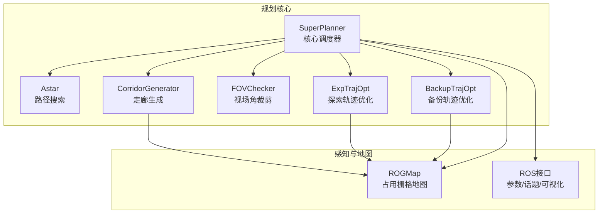
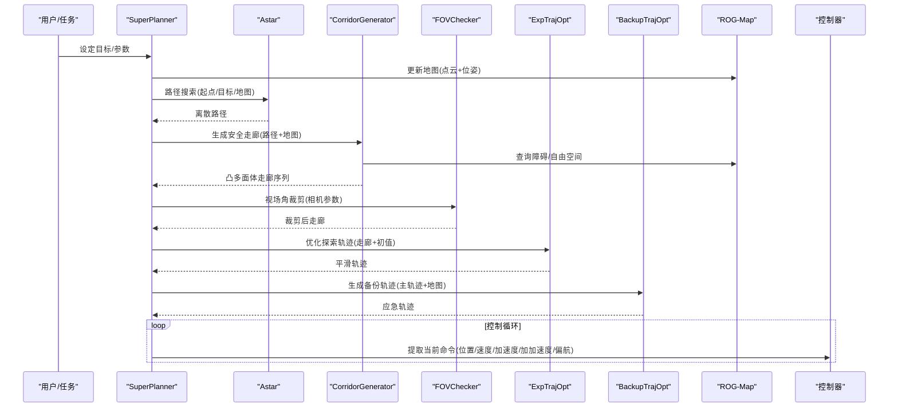
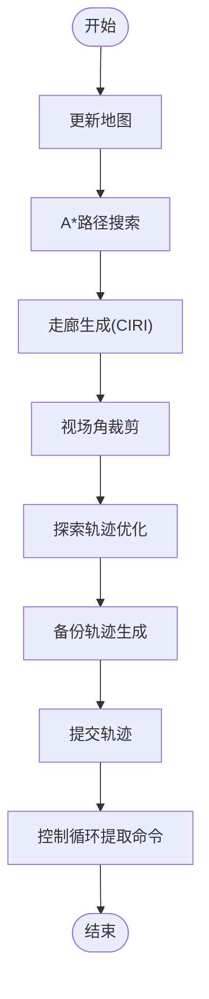
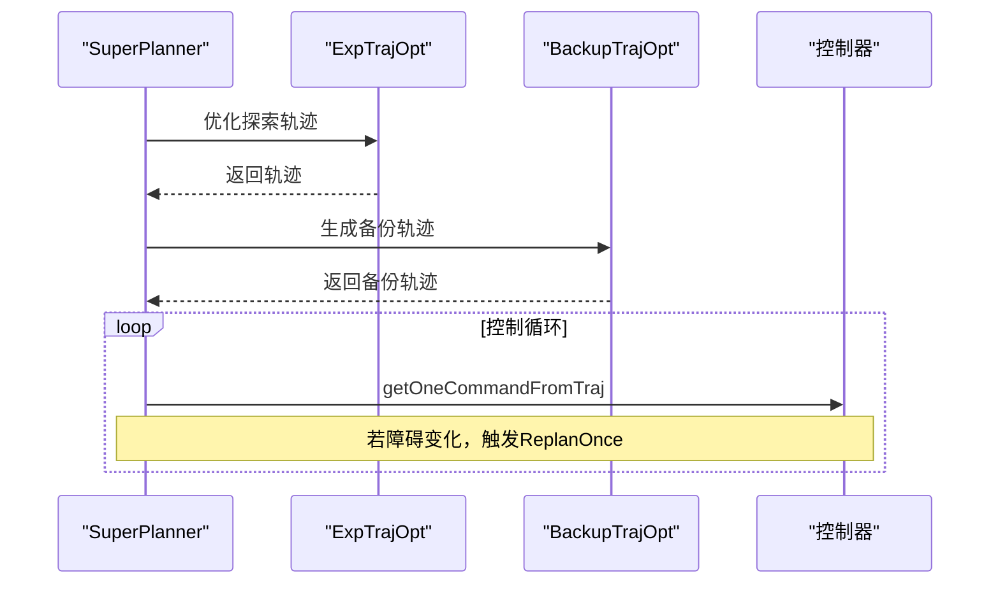
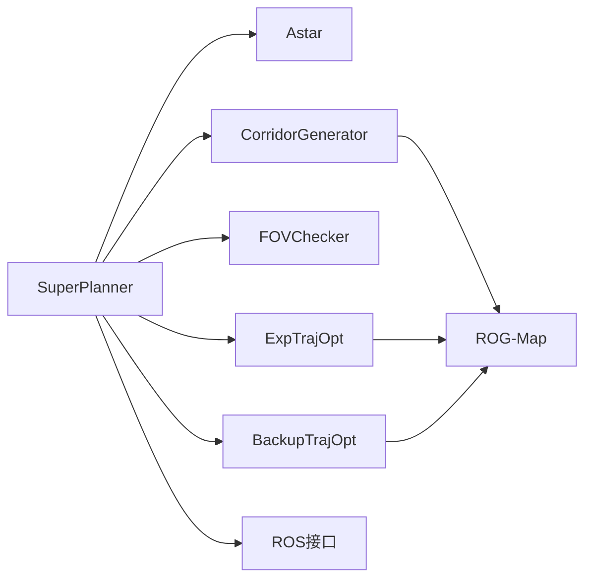

# 核心特性与创新

<cite>
**本文引用的文件**
- [README.md](file://src/SUPER/README.md)
- [README_zh.md](file://src/SUPER/README_zh.md)
- [super_planner.h](file://src/SUPER/super_planner/include/super_core/super_planner.h)
- [ciri.h](file://src/SUPER/super_planner/include/super_core/ciri.h)
- [corridor_generator.h](file://src/SUPER/super_planner/include/super_core/corridor_generator.h)
- [fov_checker.h](file://src/SUPER/super_planner/include/super_core/fov_checker.h)
- [rog_map.h](file://src/SUPER/rog_map/include/rog_map/rog_map.h)
- [exp_traj_optimizer_s4.h](file://src/SUPER/super_planner/include/traj_opt/exp_traj_optimizer_s4.h)
- [backup_traj_optimizer_s4.h](file://src/SUPER/super_planner/include/traj_opt/backup_traj_optimizer_s4.h)
- [API_REFERENCE.md](file://src/SUPER/super_planner/docs/API_REFERENCE.md)
- [CONFIGURATION_GUIDE.md](file://src/SUPER/super_planner/docs/CONFIGURATION_GUIDE.md)
- [static_high_speed.yaml](file://src/SUPER/super_planner/config/static_high_speed.yaml)
- [static_dense.yaml](file://src/SUPER/super_planner/config/static_dense.yaml)
- [super_planner.cpp](file://src/SUPER/super_planner/src/super_core/super_planner.cpp)
</cite>

## 目录
1. [引言](#引言)
2. [项目结构](#项目结构)
3. [核心组件](#核心组件)
4. [架构总览](#架构总览)
5. [详细组件分析](#详细组件分析)
6. [依赖关系分析](#依赖关系分析)
7. [性能考量](#性能考量)
8. [故障排查指南](#故障排查指南)
9. [结论](#结论)
10. [附录](#附录)

## 引言
本文件聚焦SUPER系统的“核心特性与创新”，围绕以下关键能力展开：安全保证的高速导航、挑战环境下的自主飞行、多传感器融合、实时重规划与避障。我们将结合源码结构与文档，解释技术实现原理、实际应用价值、与传统无人机导航系统的差异、性能指标与实验数据支撑，并给出在不同环境下的适应性与鲁棒性说明。内容兼顾概念性与技术细节，帮助不同技术水平的读者快速理解与落地。

## 项目结构
SUPER采用模块化分层架构，核心由“路径搜索 + 走廊生成 + 视场角裁剪 + 轨迹优化 + 备份轨迹”构成，配合ROG-Map地图与ROS接口，形成闭环的规划-执行链路。关键模块职责如下：
- 路径搜索（A*）：离散路径生成，兼顾分辨率与实时性
- 走廊生成（CorridorGenerator + CIRI）：基于点云的凸多面体安全走廊
- 视场角裁剪（FOVChecker）：相机/传感器可视范围约束
- 轨迹优化（ExpTrajOpt + BackupTrajOpt）：双层轨迹优化，探索与备份
- 地图（ROG-Map）：占用栅格地图，支持动态更新与虚拟边界
- ROS接口：参数服务器、话题订阅、可视化与日志

图表来源
- [super_planner.h](file://src/SUPER/super_planner/include/super_core/super_planner.h#L55-L125)
- [corridor_generator.h](file://src/SUPER/super_planner/include/super_core/corridor_generator.h#L56-L120)
- [fov_checker.h](file://src/SUPER/super_planner/include/super_core/fov_checker.h#L41-L130)
- [exp_traj_optimizer_s4.h](file://src/SUPER/super_planner/include/traj_opt/exp_traj_optimizer_s4.h#L55-L120)
- [backup_traj_optimizer_s4.h](file://src/SUPER/super_planner/include/traj_opt/backup_traj_optimizer_s4.h#L52-L120)
- [rog_map.h](file://src/SUPER/rog_map/include/rog_map/rog_map.h#L39-L70)

章节来源
- [README.md](file://src/SUPER/README.md#L96-L200)
- [API_REFERENCE.md](file://src/SUPER/super_planner/docs/API_REFERENCE.md#L27-L55)

## 核心组件
- SuperPlanner：统一调度器，协调路径搜索、走廊生成、轨迹优化与备份轨迹，提供规划入口与命令提取接口
- CorridorGenerator + CIRI：从路径与点云生成安全走廊，支持IRIS迭代与多面体凸分解
- FOVChecker：基于相机/传感器参数裁剪走廊，保证可视性与安全性
- ExpTrajOpt + BackupTrajOpt：双层轨迹优化，探索轨迹追求平滑与效率，备份轨迹强调快速应急
- ROG-Map：robocentric占用栅格地图，支持虚拟地面/天花板、动态更新与概率更新
- 配置与参数：YAML配置 + ROS2动态参数，支持运行时调整

章节来源
- [super_planner.h](file://src/SUPER/super_planner/include/super_core/super_planner.h#L59-L125)
- [corridor_generator.h](file://src/SUPER/super_planner/include/super_core/corridor_generator.h#L56-L120)
- [ciri.h](file://src/SUPER/super_planner/include/super_core/ciri.h#L67-L140)
- [fov_checker.h](file://src/SUPER/super_planner/include/super_core/fov_checker.h#L41-L130)
- [exp_traj_optimizer_s4.h](file://src/SUPER/super_planner/include/traj_opt/exp_traj_optimizer_s4.h#L55-L120)
- [backup_traj_optimizer_s4.h](file://src/SUPER/super_planner/include/traj_opt/backup_traj_optimizer_s4.h#L52-L120)
- [rog_map.h](file://src/SUPER/rog_map/include/rog_map/rog_map.h#L39-L70)

## 架构总览
下图展示从目标设定到命令下发的完整流程，体现“离线路径 + 在线走廊 + 视场约束 + 双层轨迹优化 + 备份应急”的闭环：

图表来源
- [super_planner.cpp](file://src/SUPER/super_planner/src/super_core/super_planner.cpp#L76-L175)
- [API_REFERENCE.md](file://src/SUPER/super_planner/docs/API_REFERENCE.md#L520-L558)

## 详细组件分析

### 安全保证的高速导航能力
- 技术要点
  - 双层轨迹优化：探索轨迹追求平滑与效率，备份轨迹强调快速应急
  - 安全走廊：基于ROG-Map与CIRI的凸多面体走廊，保证轨迹在安全边界内
  - 动态参数：通过ROS2参数服务器实时调整速度/加速度/加加速度上限与惩罚权重
  - 高速场景预置：提供静态高速配置，强化时间惩罚与较低平滑权重，提升速度
- 实现路径
  - 规划入口：PlanFromRest/ReplanOnce
  - 优化器：ExpTrajOpt/BackupTrajOpt
  - 地图与走廊：ROG-Map + CorridorGenerator + CIRI
- 性能与指标
  - 预置高速场景参数（见static_high_speed.yaml），在复杂环境中仍可维持较高线速度与加速度
  - 规划周期：路径搜索~50ms、走廊生成~20ms、轨迹优化~100-200ms、备份轨迹~50-100ms（总计~200-400ms）

图表来源
- [super_planner.cpp](file://src/SUPER/super_planner/src/super_core/super_planner.cpp#L76-L175)
- [exp_traj_optimizer_s4.h](file://src/SUPER/super_planner/include/traj_opt/exp_traj_optimizer_s4.h#L326-L371)
- [backup_traj_optimizer_s4.h](file://src/SUPER/super_planner/include/traj_opt/backup_traj_optimizer_s4.h#L154-L212)

章节来源
- [super_planner.h](file://src/SUPER/super_planner/include/super_core/super_planner.h#L138-L147)
- [exp_traj_optimizer_s4.h](file://src/SUPER/super_planner/include/traj_opt/exp_traj_optimizer_s4.h#L326-L371)
- [backup_traj_optimizer_s4.h](file://src/SUPER/super_planner/include/traj_opt/backup_traj_optimizer_s4.h#L154-L212)
- [static_high_speed.yaml](file://src/SUPER/super_planner/config/static_high_speed.yaml#L42-L95)

### 挑战环境下的自主飞行性能
- 技术要点
  - 密集环境预置：提供静态高密度配置，降低走廊宽度与线段长度，提高重规划频率
  - 虚拟边界：ROG-Map支持虚拟地面/天花板，避免碰撞与越界
  - 视场角约束：FOVChecker根据相机参数裁剪走廊，避免不可视区域
- 实验与适配
  - static_dense.yaml针对高密度场景，降低走廊边界与线段长度，提升鲁棒性
  - 通过参数服务器动态调整规划参数，适配不同环境

章节来源
- [static_dense.yaml](file://src/SUPER/super_planner/config/static_dense.yaml#L11-L35)
- [static_dense.yaml](file://src/SUPER/super_planner/config/static_dense.yaml#L41-L95)
- [rog_map.h](file://src/SUPER/rog_map/include/rog_map/rog_map.h#L39-L70)
- [fov_checker.h](file://src/SUPER/super_planner/include/super_core/fov_checker.h#L139-L192)

### 多传感器融合技术
- 技术要点
  - ROG-Map支持概率更新与raycasting，融合激光雷达点云与里程计位姿
  - ROS接口订阅点云与里程计话题，自动更新地图
  - 可选虚拟地面/天花板，提升室内/复杂环境鲁棒性
- 实践建议
  - 确保输入点云在世界坐标系（参见README中的已知问题）
  - 使用参数服务器统一管理传感器参数与地图配置

章节来源
- [rog_map.h](file://src/SUPER/rog_map/include/rog_map/rog_map.h#L39-L70)
- [README_zh.md](file://src/SUPER/README_zh.md#L210-L212)

### 实时重规划与避障能力
- 技术要点
  - ReplanOnce：在飞行中进行增量重规划，复用已生成轨迹
  - 备份轨迹：当障碍物导致走廊失效时，快速生成应急轨迹
  - 动态参数：运行时参数同步，支持快速调参
- 流程与接口
  - PlanFromRest/ReplanOnce入口
  - getOneCommandFromTraj提取当前命令
  - updateRuntimeParams同步参数

图表来源
- [super_planner.h](file://src/SUPER/super_planner/include/super_core/super_planner.h#L138-L147)
- [super_planner.cpp](file://src/SUPER/super_planner/src/super_core/super_planner.cpp#L178-L200)

章节来源
- [super_planner.h](file://src/SUPER/super_planner/include/super_core/super_planner.h#L138-L147)
- [super_planner.cpp](file://src/SUPER/super_planner/src/super_core/super_planner.cpp#L178-L200)

## 依赖关系分析
- 组件耦合
  - SuperPlanner对Astar、CorridorGenerator、FOVChecker、轨迹优化器与ROG-Map存在直接依赖
  - 轨迹优化器依赖地图与走廊信息，形成“地图→走廊→轨迹”的单向依赖
- 外部依赖
  - ROS2参数服务器与话题系统
  - Eigen、PCL等第三方库
- 参数同步
  - updateRuntimeParams将ROS2参数同步到动态配置，保障全局一致性

图表来源
- [super_planner.h](file://src/SUPER/super_planner/include/super_core/super_planner.h#L31-L53)
- [API_REFERENCE.md](file://src/SUPER/super_planner/docs/API_REFERENCE.md#L27-L55)

章节来源
- [super_planner.h](file://src/SUPER/super_planner/include/super_core/super_planner.h#L241-L296)

## 性能考量
- 规划周期与模块耗时
  - 路径搜索：约50ms
  - 走廊生成：约20ms
  - 轨迹优化：约100-200ms
  - 备份轨迹：约50-100ms
  - 总计：约200-400ms
- 影响因素
  - 地图分辨率与走廊宽度
  - 惩罚权重与优化精度
  - 视场角裁剪与IRIS迭代次数
- 优化建议
  - 高速场景：增大时间惩罚权重，降低平滑权重
  - 密集环境：减小走廊边界与线段长度，提高重规划频率
  - 参数调优：使用rqt_reconfigure或ros2 param set进行动态调整

章节来源
- [API_REFERENCE.md](file://src/SUPER/super_planner/docs/API_REFERENCE.md#L779-L789)
- [CONFIGURATION_GUIDE.md](file://src/SUPER/super_planner/docs/CONFIGURATION_GUIDE.md#L174-L223)

## 故障排查指南
- 常见问题与定位
  - 无起始点/目标点：检查里程计与目标设置
  - 路径搜索失败：检查地图分辨率与障碍密度
  - 轨迹优化失败：检查走廊有效性与惩罚权重
  - 动态参数不生效：确认参数名大小写与回调是否触发
- 日志与可视化
  - 使用plotCmdLog.py评估轨迹质量
  - 启用可视化观察路径、走廊与轨迹
- 已知问题
  - 使用自定义仿真器或非FAST-LIO2的LiDAR里程计时，确保输入点云在世界坐标系

章节来源
- [README_zh.md](file://src/SUPER/README_zh.md#L210-L212)
- [API_REFERENCE.md](file://src/SUPER/super_planner/docs/API_REFERENCE.md#L791-L800)

## 结论
SUPER通过“双层轨迹优化 + 安全走廊 + 视场角约束 + 多传感器融合 + 实时重规划”的体系，实现了在挑战环境下的高速、安全与鲁棒的自主导航。其模块化设计与ROS2参数系统便于在不同场景下快速适配与优化，具备良好的工程落地价值。建议在实际部署中结合具体传感器与任务需求，利用预置场景与动态参数进行精细化调参。

## 附录
- 快速开始与测试
  - 高速导航/密集环境/点击演示均有对应launch与配置
- 参数与配置
  - YAML配置文件与ROS2动态参数协同，支持运行时调整
- 性能基准
  - 规划周期与模块耗时见API参考与配置指南

章节来源
- [README.md](file://src/SUPER/README.md#L143-L200)
- [CONFIGURATION_GUIDE.md](file://src/SUPER/super_planner/docs/CONFIGURATION_GUIDE.md#L226-L290)