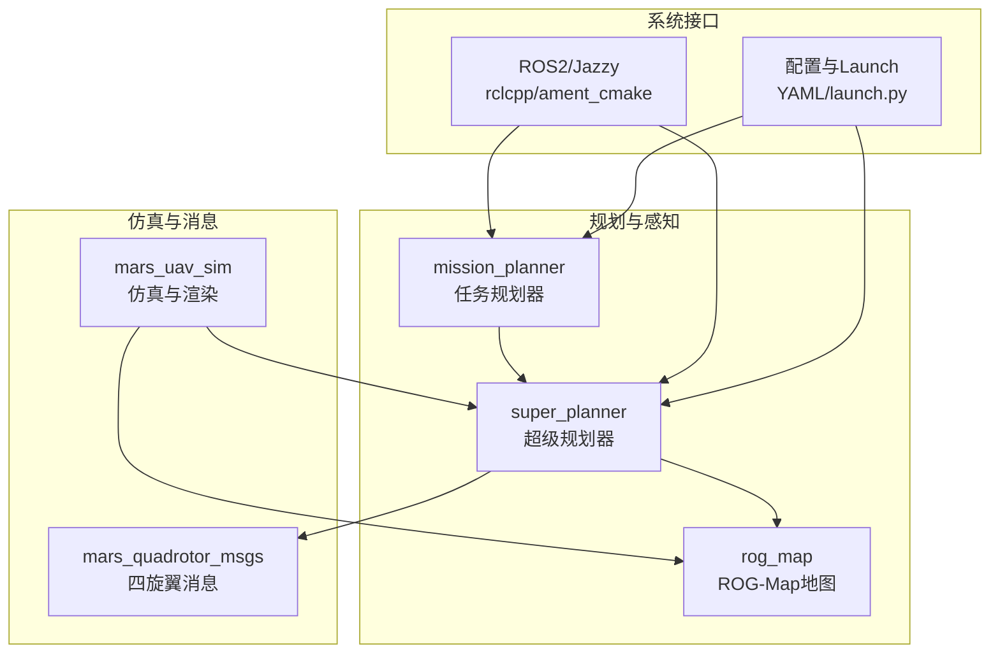
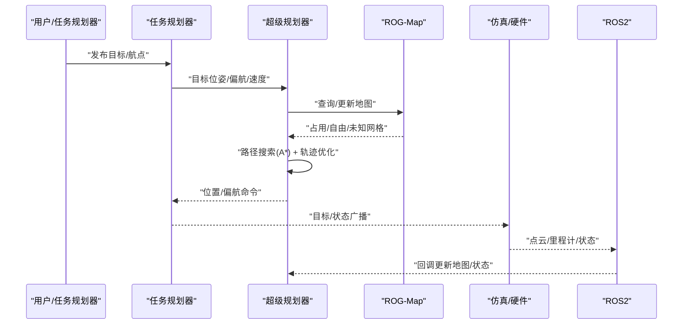
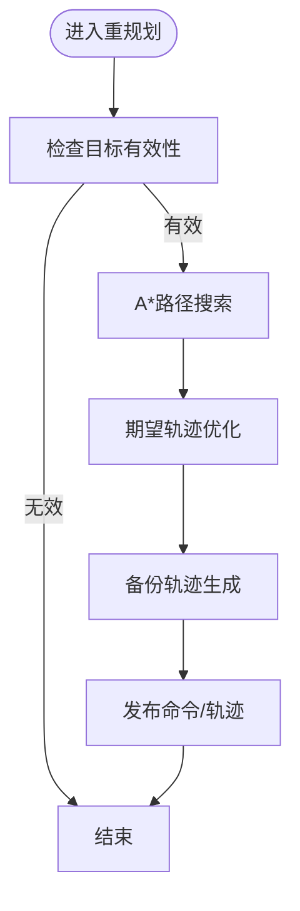
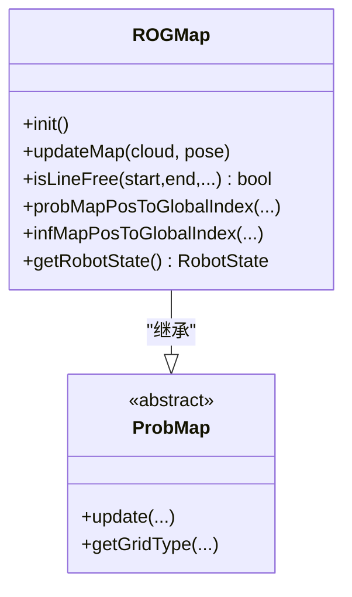
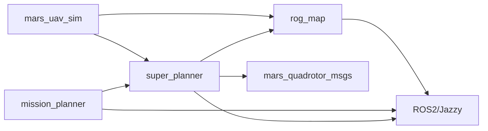

# 项目概述

<cite>
**本文档引用的文件**
- [README.md](file://src/SUPER/README.md)
- [README_zh.md](file://src/SUPER/README_zh.md)
- [README_JAZZY.md](file://src/SUPER/README_JAZZY.md)
- [install_dependencies.sh](file://src/SUPER/install_dependencies.sh)
- [super_planner/package.xml](file://src/SUPER/super_planner/package.xml)
- [mission_planner/package.xml](file://src/SUPER/mission_planner/package.xml)
- [rog_map/package.xml](file://src/SUPER/rog_map/package.xml)
- [mars_quadrotor_msgs/package.xml](file://src/SUPER/mars_uav_sim/mars_quadrotor_msgs/package.xml)
- [super_planner/config/click.yaml](file://src/SUPER/super_planner/config/click.yaml)
- [mission_planner/config/waypoint.yaml](file://src/SUPER/mission_planner/config/waypoint.yaml)
- [rog_map/include/rog_map/rog_map.h](file://src/SUPER/rog_map/include/rog_map/rog_map.h)
- [super_planner/include/super_core/super_planner.h](file://src/SUPER/super_planner/include/super_core/super_planner.h)
- [super_planner/Apps/fsm_node_ros2.cpp](file://src/SUPER/super_planner/Apps/fsm_node_ros2.cpp)
- [mission_planner/Apps/ros2_waypoint_mission.cpp](file://src/SUPER/mission_planner/Apps/ros2_waypoint_mission.cpp)
</cite>

## 目录
1. [简介](#简介)
2. [项目结构](#项目结构)
3. [核心组件](#核心组件)
4. [架构总览](#架构总览)
5. [详细组件分析](#详细组件分析)
6. [依赖关系分析](#依赖关系分析)
7. [性能考量](#性能考量)
8. [故障排查指南](#故障排查指南)
9. [结论](#结论)
10. [附录](#附录)

## 简介
SUPER（安全保证的高速无人机导航系统）由香港大学MaRS实验室研发，旨在实现复杂环境下的安全、高速、自主飞行。项目已在《Science Robotics》期刊发表，并配套ROS2/Jazzy版本与自动化依赖安装脚本，支持高分辨率激光雷达与多传感器融合，具备挑战环境下的自主飞行能力与丰富的仿真与可视化工具链。项目强调“安全保证”的轨迹规划与实时响应，适合在大范围探索、目标跟踪等实际场景中部署。

- 项目背景与重要性
  - 发表于《Science Robotics》，体现学术影响力与工程成熟度。
  - 依托MaRS实验室多年积累，融合FAST-LIO、ROG-Map、MARSIM等关键基础设施。
  - 提供ROS2 Jazzy适配与一键依赖安装脚本，降低部署门槛。

- 主要创新点
  - 安全保证的高速导航：通过两阶段轨迹优化框架与安全走廊生成，兼顾速度与安全性。
  - 挑战环境下的自主飞行：在密集障碍、动态场景中实现稳定路径搜索与轨迹优化。
  - 多传感器融合：结合激光雷达、里程计等数据，构建robocentric占用栅格地图（ROG-Map）并进行实时更新。

- 应用场景
  - 大范围自主探索：作为点到点导航的局部规划器，配合任务规划器实现长距离探索。
  - 目标跟踪：在昼夜条件下实现稳定的跟随与避障。

**章节来源**
- [README.md](file://src/SUPER/README.md#L1-L278)
- [README_zh.md](file://src/SUPER/README_zh.md#L1-L240)
- [README_JAZZY.md](file://src/SUPER/README_JAZZY.md#L1-L168)

## 项目结构
项目采用按功能域划分的多包结构，核心模块包括：
- super_planner：超级规划器（轨迹规划、路径搜索、状态机驱动）
- rog_map：ROG-Map地图系统（robocentric占用栅格地图）
- mission_planner：任务规划器（航点/点击式目标发布）
- mars_uav_sim：仿真与消息定义（含渲染、完美模型、消息包）
- mars_quadrotor_msgs：四旋翼相关消息定义
- 配置与启动：各模块的YAML配置与launch脚本

**图表来源**
- [super_planner/package.xml](file://src/SUPER/super_planner/package.xml#L1-L21)
- [mission_planner/package.xml](file://src/SUPER/mission_planner/package.xml#L1-L19)
- [rog_map/package.xml](file://src/SUPER/rog_map/package.xml#L1-L27)
- [mars_quadrotor_msgs/package.xml](file://src/SUPER/mars_uav_sim/mars_quadrotor_msgs/package.xml#L1-L26)

**章节来源**
- [super_planner/package.xml](file://src/SUPER/super_planner/package.xml#L1-L21)
- [mission_planner/package.xml](file://src/SUPER/mission_planner/package.xml#L1-L19)
- [rog_map/package.xml](file://src/SUPER/rog_map/package.xml#L1-L27)
- [mars_quadrotor_msgs/package.xml](file://src/SUPER/mars_uav_sim/mars_quadrotor_msgs/package.xml#L1-L26)

## 核心组件
- 超级规划器（SuperPlanner）
  - 职责：实时轨迹规划、路径搜索、状态机协调、与地图/ROS接口交互。
  - 关键能力：两阶段轨迹优化（期望轨迹+备份轨迹）、安全走廊生成、可视FOV裁剪、动态参数同步。
  - 依赖：ROG-Map、轨迹优化器、路径搜索（A*）、ROS2接口。

- ROG-Map地图系统
  - 职责：robocentric占用栅格地图构建与维护，支持概率更新、ESDF、滑动窗口、前沿提取等。
  - 关键能力：点云射线投射更新、自由/占用/未知网格判定、索引转换、线段连通性查询。

- 任务规划器（Waypoint Mission）
  - 职责：航点/点击式目标发布、里程计订阅、任务切换与延迟触发。
  - 关键能力：RViz交互、Mavros兼容、常时序触发、目标切换阈值控制。

- 仿真与消息
  - mars_uav_sim：提供渲染、完美模型、360°相机/激光配置、GL/GLFW/Eigen等依赖。
  - mars_quadrotor_msgs：定义位置命令、轨迹、状态等消息类型，支撑ROS2通信。

**章节来源**
- [super_planner/include/super_core/super_planner.h](file://src/SUPER/super_planner/include/super_core/super_planner.h#L55-L298)
- [rog_map/include/rog_map/rog_map.h](file://src/SUPER/rog_map/include/rog_map/rog_map.h#L39-L131)
- [mission_planner/Apps/ros2_waypoint_mission.cpp](file://src/SUPER/mission_planner/Apps/ros2_waypoint_mission.cpp#L1-L23)
- [mars_quadrotor_msgs/package.xml](file://src/SUPER/mars_uav_sim/mars_quadrotor_msgs/package.xml#L1-L26)

## 架构总览
整体架构围绕“任务规划器—超级规划器—地图系统—仿真/硬件”的闭环展开。任务规划器负责目标下发与状态管理，超级规划器进行实时轨迹与路径规划，ROG-Map提供环境感知与地图更新，仿真与消息层提供可视化与跨模块通信。

**图表来源**
- [super_planner/include/super_core/super_planner.h](file://src/SUPER/super_planner/include/super_core/super_planner.h#L138-L147)
- [rog_map/include/rog_map/rog_map.h](file://src/SUPER/rog_map/include/rog_map/rog_map.h#L112-L114)
- [mission_planner/Apps/ros2_waypoint_mission.cpp](file://src/SUPER/mission_planner/Apps/ros2_waypoint_mission.cpp#L11-L22)

## 详细组件分析

### 超级规划器（SuperPlanner）
- 设计要点
  - 模块化设计：路径搜索、轨迹优化、安全走廊、ROS接口、FOV检查等解耦。
  - 动态参数同步：运行时从ROS参数服务器读取并同步至优化器动态配置。
  - 线程安全：轨迹锁定/解锁、重规划互斥，保障实时性与一致性。
  - 可视化与日志：支持可视化开关、日志记录与重规划耗时统计。

- 关键流程（重规划）

**图表来源**
- [super_planner/include/super_core/super_planner.h](file://src/SUPER/super_planner/include/super_core/super_planner.h#L138-L147)
- [super_planner/include/super_core/super_planner.h](file://src/SUPER/super_planner/include/super_core/super_planner.h#L148-L154)

- 参数与配置
  - 配置文件覆盖：规划器、轨迹优化、A*、ROG-Map等模块参数集中管理。
  - 运行时参数：支持在运行时动态更新速度/加速度/抖动/惩罚权重等。

**章节来源**
- [super_planner/include/super_core/super_planner.h](file://src/SUPER/super_planner/include/super_core/super_planner.h#L55-L298)
- [super_planner/config/click.yaml](file://src/SUPER/super_planner/config/click.yaml#L1-L190)

### ROG-Map地图系统
- 设计要点
  - robocentric视角：以机器人为中心的栅格表示，提升大场景与高分辨率下的效率。
  - 多层表示：概率占用、膨胀、ESDF、前沿提取等协同工作。
  - 实时更新：射线投射、批量更新、滑动窗口、未知区域处理策略。

- 类关系示意

**图表来源**
- [rog_map/include/rog_map/rog_map.h](file://src/SUPER/rog_map/include/rog_map/rog_map.h#L39-L131)

**章节来源**
- [rog_map/include/rog_map/rog_map.h](file://src/SUPER/rog_map/include/rog_map/rog_map.h#L39-L131)

### 任务规划器（Waypoint Mission）
- 设计要点
  - 目标发布：支持航点文件与点击式目标，提供切换阈值与发布周期控制。
  - 里程计与触发：支持RViz/Mavros/常时序三种起始触发方式。
  - 简洁入口：单节点实现目标发布与状态管理。

**章节来源**
- [mission_planner/Apps/ros2_waypoint_mission.cpp](file://src/SUPER/mission_planner/Apps/ros2_waypoint_mission.cpp#L1-L23)
- [mission_planner/config/waypoint.yaml](file://src/SUPER/mission_planner/config/waypoint.yaml#L1-L19)

### 仿真与消息（FSM节点）
- 设计要点
  - FSM驱动：封装状态机与规划器交互，支持仿真时间切换、参数声明与初始化。
  - 启动流程：参数解析、节点初始化、多线程执行器、优雅退出。

**章节来源**
- [super_planner/Apps/fsm_node_ros2.cpp](file://src/SUPER/super_planner/Apps/fsm_node_ros2.cpp#L48-L101)

## 依赖关系分析
- ROS2/Jazzy生态
  - rclcpp、ament_cmake、标准消息与几何消息、tf2_ros、pcl_conversions等。
- 数学与图形库
  - Eigen（矩阵运算）、GLFW/GLAD/GLM（渲染）、yaml-cpp（配置）、PCL（点云）。
- 工具链
  - Ceres、NLopt、OpenCV、spdlog、ZeroMQ等。

**图表来源**
- [super_planner/package.xml](file://src/SUPER/super_planner/package.xml#L7-L15)
- [mission_planner/package.xml](file://src/SUPER/mission_planner/package.xml#L7-L13)
- [rog_map/package.xml](file://src/SUPER/rog_map/package.xml#L10-L18)
- [mars_quadrotor_msgs/package.xml](file://src/SUPER/mars_uav_sim/mars_quadrotor_msgs/package.xml#L10-L14)

**章节来源**
- [super_planner/package.xml](file://src/SUPER/super_planner/package.xml#L1-L21)
- [mission_planner/package.xml](file://src/SUPER/mission_planner/package.xml#L1-L19)
- [rog_map/package.xml](file://src/SUPER/rog_map/package.xml#L1-L27)
- [mars_quadrotor_msgs/package.xml](file://src/SUPER/mars_uav_sim/mars_quadrotor_msgs/package.xml#L1-L26)

## 性能考量
- 实时性
  - 重规划周期与前瞻窗口：通过配置文件中的重规划频率与前瞻时间控制吞吐与稳定性。
  - 模块耗时统计：规划器内部记录前后端耗时，便于定位瓶颈。
- 地图与搜索
  - ROG-Map分辨率与膨胀步数：影响更新效率与安全裕度。
  - A*启发函数：欧氏距离精度更高但计算开销更大，需根据场景权衡。
- 优化器参数
  - 最大速度/加速度/抖动与惩罚权重：直接影响轨迹平滑性与安全性，需结合硬件能力调参。

**章节来源**
- [super_planner/config/click.yaml](file://src/SUPER/super_planner/config/click.yaml#L105-L167)
- [super_planner/include/super_core/super_planner.h](file://src/SUPER/super_planner/include/super_core/super_planner.h#L207-L225)

## 故障排查指南
- 依赖安装
  - 使用ROS2 Jazzy自动化安装脚本一次性安装系统与Python依赖，减少环境差异导致的问题。
- 构建与运行
  - 确认已正确source工作空间；若出现“包未找到”，检查colcon构建与setup.bash加载。
  - 若构建报错，确认依赖齐全且ROS2发行版匹配。
- 地图与传感器
  - 使用自定义.pcd地图时，确保点云在世界坐标系（frame_id与/tf不参与ROG-Map更新）。
- 可视化与日志
  - 启用可视化与日志开关，利用日志分析轨迹质量与重规划耗时。

**章节来源**
- [README_JAZZY.md](file://src/SUPER/README_JAZZY.md#L37-L95)
- [install_dependencies.sh](file://src/SUPER/install_dependencies.sh#L1-L71)
- [README.md](file://src/SUPER/README.md#L245-L247)
- [super_planner/config/click.yaml](file://src/SUPER/super_planner/config/click.yaml#L18-L21)

## 结论
SUPER在MaRS实验室的长期积累与《Science Robotics》的认可下，形成了以“安全保证”为核心的高速无人机导航体系。其模块化架构、robocentric地图与两阶段轨迹优化，使其在挑战环境下具备出色的适应性与可扩展性。结合完善的ROS2/Jazzy生态与自动化依赖安装，项目为初学者与专业开发者提供了清晰的入门路径与深入的技术细节。

## 附录
- 快速开始（ROS2 Jazzy）
  - 安装依赖：使用自动化脚本安装ROS2 Jazzy、系统库与Python依赖。
  - 构建与运行：colcon构建指定包，source安装环境，运行RViz与规划器节点。
- 配置与调参
  - 规划器参数：在配置文件中调整速度/加速度/惩罚权重/可视化等。
  - 任务规划器：设置目标发布周期、切换阈值与触发方式。
- 应用案例
  - 大范围自主探索：作为局部规划器与任务规划器协作，实现长距离探索。
  - 目标跟踪：在昼夜条件下实现稳定跟随与避障。

**章节来源**
- [README_JAZZY.md](file://src/SUPER/README_JAZZY.md#L15-L95)
- [super_planner/config/click.yaml](file://src/SUPER/super_planner/config/click.yaml#L1-L190)
- [mission_planner/config/waypoint.yaml](file://src/SUPER/mission_planner/config/waypoint.yaml#L1-L19)
- [README.md](file://src/SUPER/README.md#L72-L81)