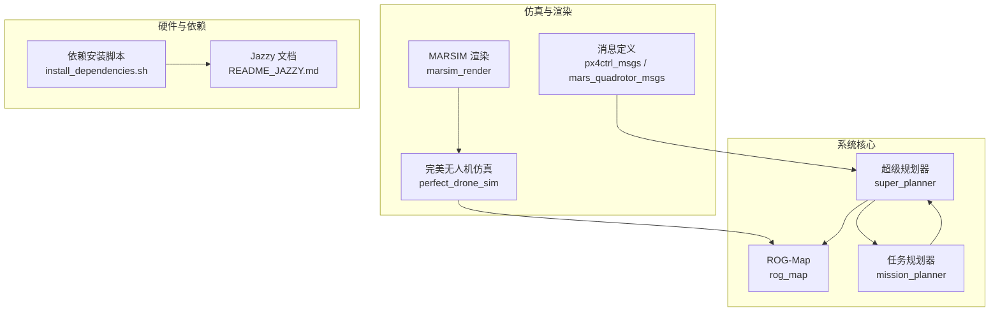
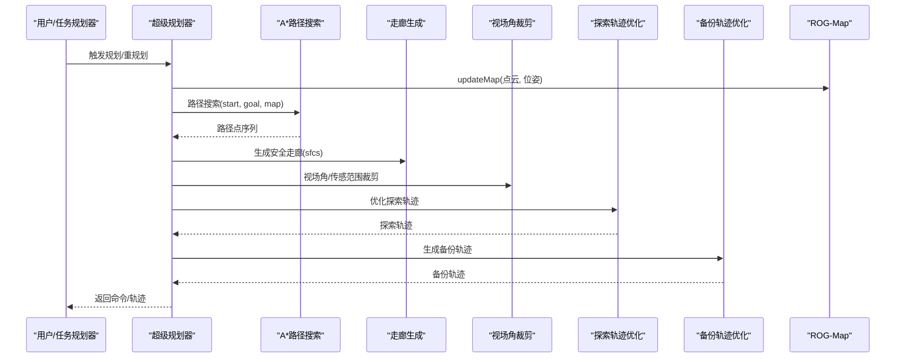
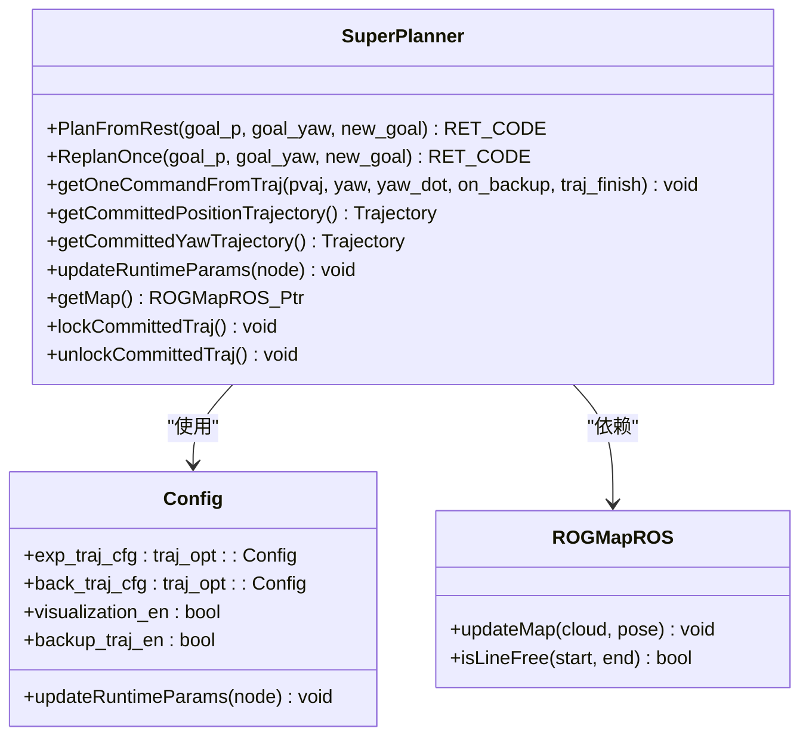
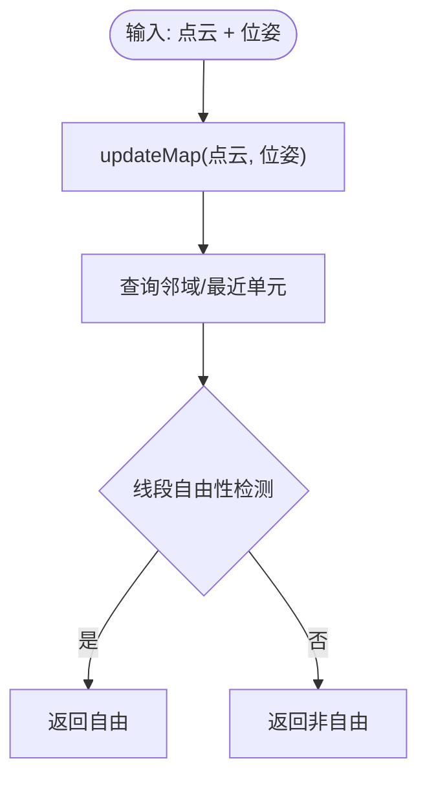
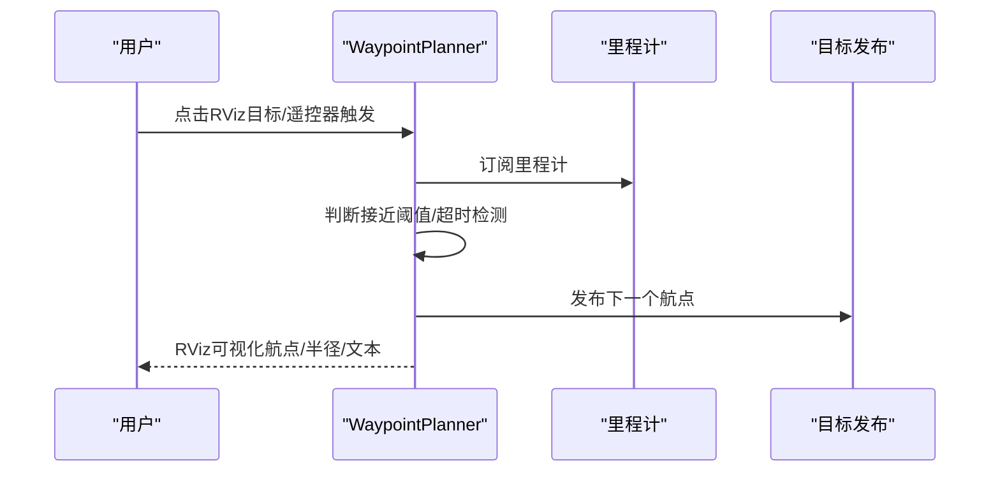
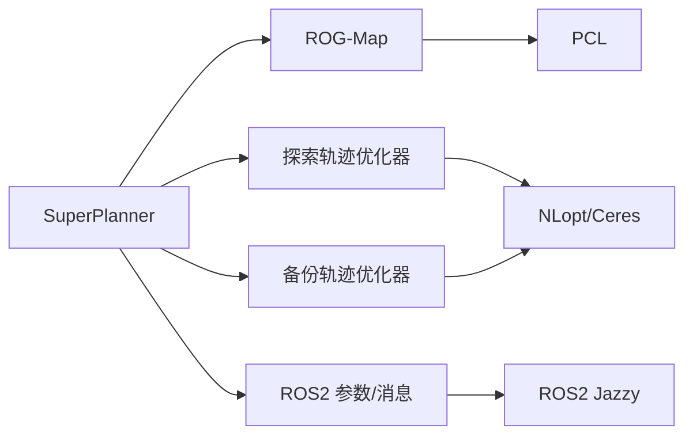

# 项目背景与简介

<cite>
**本文引用的文件**
- [README.md](file://src/SUPER/README.md)
- [README_zh.md](file://src/SUPER/README_zh.md)
- [README_JAZZY.md](file://src/SUPER/README_JAZZY.md)
- [install_dependencies.sh](file://src/SUPER/install_dependencies.sh)
- [super_planner.h](file://src/SUPER/super_planner/include/super_core/super_planner.h)
- [config.hpp](file://src/SUPER/super_planner/include/super_core/config.hpp)
- [API_REFERENCE.md](file://src/SUPER/super_planner/docs/API_REFERENCE.md)
- [rog_map.h](file://src/SUPER/rog_map/include/rog_map/rog_map.h)
- [ros2_waypoint_planner.hpp](file://src/SUPER/mission_planner/include/waypoint_mission/ros2_waypoint_planner.hpp)
</cite>

## 目录
1. [引言](#引言)
2. [项目结构](#项目结构)
3. [核心组件](#核心组件)
4. [架构总览](#架构总览)
5. [详细组件分析](#详细组件分析)
6. [依赖关系分析](#依赖关系分析)
7. [性能考量](#性能考量)
8. [故障排查指南](#故障排查指南)
9. [结论](#结论)
10. [附录](#附录)

## 引言
SUPER（安全保证的高速无人机导航系统）是MaRS实验室（香港大学）研发的一套面向多旋翼无人机的高安全性、高实时性的自主导航系统。该系统在《Science Robotics》期刊上发表，标志着其在无人机高速、复杂环境自主导航领域的突破性进展。项目旨在为无人机提供“安全保证”的高速自主导航能力，解决传统导航系统在动态、密集、未知环境中难以兼顾安全性与速度的问题。

项目名称“SUPER”取自“Safety-assured High-speed Navigation for MAVs”，体现了其核心使命：在保证飞行安全的前提下，实现高速、鲁棒、可扩展的自主导航。系统采用“双轨迹优化+安全走廊生成+动态参数配置”的整体架构，结合MaRS实验室在激光SLAM、占用栅格地图、轨迹优化等领域的长期积累，形成从感知到规划再到控制的完整链路。

## 项目结构
仓库采用按功能模块划分的组织方式，核心模块包括：
- 超级规划器（super_planner）：系统核心，负责路径搜索、走廊生成、轨迹优化、备份轨迹与动态参数同步。
- 占用栅格地图（rog_map）：Robocentric Occupancy Grid Map，提供高效的大场景、高分辨率地图表示与更新。
- 任务规划器（mission_planner）：提供航点任务、RViz可视化、触发机制与演示launch。
- 仿真与渲染（mars_uav_sim）：包含MARSIM渲染、完美无人机仿真、消息定义等，支撑仿真与验证。
- 硬件与依赖脚本：提供ROS2 Jazzy的依赖安装脚本与快速搭建指南。

图表来源
- [super_planner.h](file://src/SUPER/super_planner/include/super_core/super_planner.h#L55-L100)
- [rog_map.h](file://src/SUPER/rog_map/include/rog_map/rog_map.h#L39-L56)
- [ros2_waypoint_planner.hpp](file://src/SUPER/mission_planner/include/waypoint_mission/ros2_waypoint_planner.hpp#L24-L50)
- [README_JAZZY.md](file://src/SUPER/README_JAZZY.md#L1-L168)
- [install_dependencies.sh](file://src/SUPER/install_dependencies.sh#L1-L71)

章节来源
- [README.md](file://src/SUPER/README.md#L1-L278)
- [README_zh.md](file://src/SUPER/README_zh.md#L1-L240)
- [README_JAZZY.md](file://src/SUPER/README_JAZZY.md#L1-L168)

## 核心组件
- 超级规划器（SuperPlanner）
  - 职责：统一调度路径搜索、走廊生成、FOV裁剪、轨迹优化（探索/备份）、备份轨迹生成、动态参数同步与日志记录。
  - 关键接口：PlanFromRest、ReplanOnce、getOneCommandFromTraj、updateRuntimeParams、getMap等。
  - 设计要点：模块解耦、线程安全、可插拔优化器、动态参数热更新、性能统计与日志。

- ROG-Map（占用栅格地图）
  - 职责：高效的大场景、高分辨率占用栅格地图表示，支持概率更新、线段自由性检测、邻域查找与地图更新。
  - 关键接口：updateMap、isLineFree、probMapPosToGlobalIndex等。

- 任务规划器（WaypointPlanner）
  - 职责：航点任务发布、RViz可视化、触发机制（鼠标点击/RViz目标、遥控器通道触发）、定时器驱动的目标切换。
  - 关键接口：GoalPubTimerCallback、RvizClickCallback、MavrosRcCallback、visualizeMission等。

章节来源
- [super_planner.h](file://src/SUPER/super_planner/include/super_core/super_planner.h#L59-L120)
- [config.hpp](file://src/SUPER/super_planner/include/super_core/config.hpp#L44-L151)
- [API_REFERENCE.md](file://src/SUPER/super_planner/docs/API_REFERENCE.md#L58-L325)
- [rog_map.h](file://src/SUPER/rog_map/include/rog_map/rog_map.h#L39-L114)
- [ros2_waypoint_planner.hpp](file://src/SUPER/mission_planner/include/waypoint_mission/ros2_waypoint_planner.hpp#L24-L160)

## 架构总览
系统采用“模块化+可插拔”的架构设计，核心流程为：输入位姿与点云→地图更新→路径搜索→走廊生成→视场角裁剪→轨迹优化→备份轨迹→实时命令下发。规划器支持动态参数热更新，可在运行时调整速度/加速度/惩罚权重等关键参数，满足不同场景需求。

图表来源
- [API_REFERENCE.md](file://src/SUPER/super_planner/docs/API_REFERENCE.md#L520-L558)
- [super_planner.h](file://src/SUPER/super_planner/include/super_core/super_planner.h#L138-L146)
- [rog_map.h](file://src/SUPER/rog_map/include/rog_map/rog_map.h#L112-L114)

## 详细组件分析

### 超级规划器（SuperPlanner）
- 设计模式与职责
  - 单一职责：统一规划流程编排与模块间协调。
  - 线程安全：轨迹读写加锁，避免并发冲突。
  - 可扩展性：优化器可替换，参数可热更新，日志可扩展。
- 关键数据结构与接口
  - 配置类Config：集中管理布尔/数值参数、轨迹优化边界与算法配置、运行时参数同步。
  - 轨迹接口：getCommittedPositionTrajectory、getCommittedYawTrajectory、getOneCommandFromTraj。
  - 动态参数：updateRuntimeParams将ROS2参数同步至优化器动态配置。
- 性能与稳定性
  - 模块耗时：路径搜索~50ms、走廊生成~20ms、轨迹优化200-400ms（含探索+备份）、总周期可控。
  - 安全保障：膨胀碰撞检测、紧急避障（CIRI）、备份轨迹冗余。

图表来源
- [super_planner.h](file://src/SUPER/super_planner/include/super_core/super_planner.h#L59-L296)
- [config.hpp](file://src/SUPER/super_planner/include/super_core/config.hpp#L44-L231)
- [rog_map.h](file://src/SUPER/rog_map/include/rog_map/rog_map.h#L39-L56)

章节来源
- [super_planner.h](file://src/SUPER/super_planner/include/super_core/super_planner.h#L59-L296)
- [config.hpp](file://src/SUPER/super_planner/include/super_core/config.hpp#L44-L231)
- [API_REFERENCE.md](file://src/SUPER/super_planner/docs/API_REFERENCE.md#L58-L325)

### ROG-Map（占用栅格地图）
- 设计理念
  - Robocentric视角下的高效占用栅格，支持概率更新、线段自由性检测、邻域查找与地图索引转换。
- 关键接口
  - updateMap：融合点云与位姿更新地图。
  - isLineFree：判断两点之间是否存在自由路径，支持多种参数化形式。
  - 索引转换：pos<->index双向转换，便于高效查询。

图表来源
- [rog_map.h](file://src/SUPER/rog_map/include/rog_map/rog_map.h#L112-L114)
- [rog_map.h](file://src/SUPER/rog_map/include/rog_map/rog_map.h#L59-L70)

章节来源
- [rog_map.h](file://src/SUPER/rog_map/include/rog_map/rog_map.h#L39-L114)

### 任务规划器（WaypointPlanner）
- 设计目标
  - 提供航点任务发布、RViz可视化、触发机制与演示launch，支撑快速验证与演示。
- 关键流程
  - 里程计订阅与超时检测、目标接近判定、定时器驱动的目标发布、RViz标记发布。
- 用户交互
  - 支持鼠标点击设置目标、遥控器通道触发、延时启动与超时告警。

图表来源
- [ros2_waypoint_planner.hpp](file://src/SUPER/mission_planner/include/waypoint_mission/ros2_waypoint_planner.hpp#L52-L160)
- [ros2_waypoint_planner.hpp](file://src/SUPER/mission_planner/include/waypoint_mission/ros2_waypoint_planner.hpp#L225-L238)

章节来源
- [ros2_waypoint_planner.hpp](file://src/SUPER/mission_planner/include/waypoint_mission/ros2_waypoint_planner.hpp#L24-L160)

## 依赖关系分析
- 内部依赖
  - SuperPlanner依赖ROG-Map进行地图更新与查询；依赖轨迹优化器（探索/备份）生成轨迹；依赖ROS接口与参数服务器实现动态参数同步。
- 外部依赖
  - 依赖Eigen、PCL、yaml-cpp、Qt OpenGL、OpenCV、NLopt、Ceres等系统库；依赖ROS2 Jazzy生态（rclcpp、sensor_msgs、geometry_msgs、nav_msgs、visualization_msgs、mavros-msgs等）。
- 版本与兼容性
  - README_JAZZY.md明确支持Ubuntu 24.04 + ROS2 Jazzy；install_dependencies.sh提供一键安装脚本，覆盖Jazzy所需依赖。

图表来源
- [API_REFERENCE.md](file://src/SUPER/super_planner/docs/API_REFERENCE.md#L27-L54)
- [README_JAZZY.md](file://src/SUPER/README_JAZZY.md#L15-L95)
- [install_dependencies.sh](file://src/SUPER/install_dependencies.sh#L10-L51)

章节来源
- [README_JAZZY.md](file://src/SUPER/README_JAZZY.md#L15-L95)
- [install_dependencies.sh](file://src/SUPER/install_dependencies.sh#L1-L71)

## 性能考量
- 模块耗时与总周期
  - 路径搜索：约50ms；走廊生成：约20ms；轨迹优化：200-400ms（探索+备份）；总周期可控，满足高频控制循环需求。
- 参数与实时性
  - 通过updateRuntimeParams实现参数热更新，避免重启；合理设置采样步长与规划时域，平衡实时性与精度。
- 地图分辨率与采样步长
  - 分辨率与最大速度决定采样步长，需在地图精度与计算负载间权衡。

章节来源
- [API_REFERENCE.md](file://src/SUPER/super_planner/docs/API_REFERENCE.md#L779-L788)
- [config.hpp](file://src/SUPER/super_planner/include/super_core/config.hpp#L129-L133)

## 故障排查指南
- 常见问题
  - 包未找到：确保已正确source工作空间setup脚本。
  - 构建错误：检查ROS2发行版与依赖是否匹配；确认ament_cmake与Python版本。
  - 权限错误：检查工作空间目录权限。
- 依赖安装
  - 使用install_dependencies.sh自动安装Jazzy依赖与系统库；或参考README_JAZZY.md的手动安装步骤。
- 参数调试
  - 通过updateRuntimeParams将ROS2参数同步至规划器；关注轨迹优化边界与惩罚权重的合理性。

章节来源
- [README_JAZZY.md](file://src/SUPER/README_JAZZY.md#L132-L160)
- [install_dependencies.sh](file://src/SUPER/install_dependencies.sh#L37-L71)
- [config.hpp](file://src/SUPER/super_planner/include/super_core/config.hpp#L158-L228)

## 结论
SUPER项目代表了MaRS实验室在无人机高速、安全、自主导航领域的系统性突破。其“双轨迹优化+安全走廊+动态参数”的架构设计，既保证了在复杂环境中的安全性，又实现了高速实时的轨迹生成与执行。项目在《Science Robotics》的发表，标志着其在学术界的影响力与认可度。通过模块化设计与ROS2生态的良好集成，SUPER为后续在真实硬件平台上的部署与应用奠定了坚实基础。

## 附录
- 项目里程碑与成就
  - 2024年12月：论文被《Science Robotics》接收。
  - 2025年1月：论文在《Science Robotics》官网作为特色文章展示。
  - 2025年3月：硬件组件发布，进一步推动落地应用。
- 相关项目与生态
  - 基于SUPER的尾座式无人机自主导航（EFOPT）、FAST-LIVO2演示等，体现SUPER在不同平台与任务中的复用价值。

章节来源
- [README.md](file://src/SUPER/README.md#L28-L34)
- [README_zh.md](file://src/SUPER/README_zh.md#L28-L34)