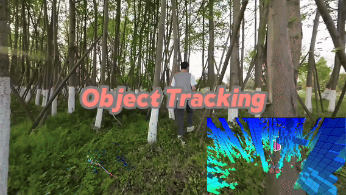
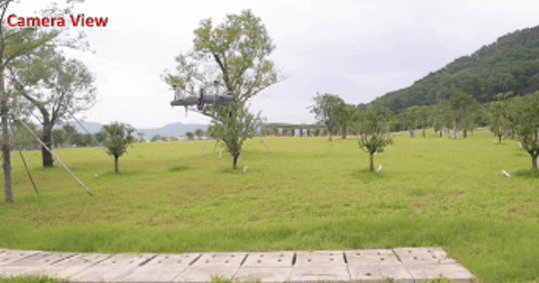
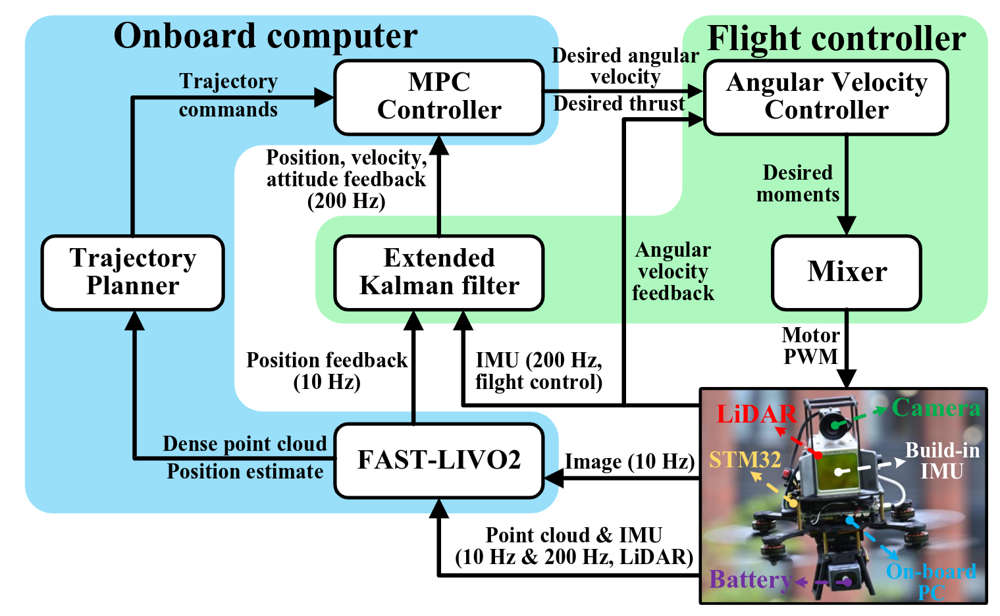

# SUPER：用于多旋翼飞行器的安全保证高速导航

<div align="center">
    <h2>SUPER: Safety-assured High-speed Navigation for MAVs</h2>
    <strong>Science Robotics' 25</strong>
    <br>
        <a href="https://github.com/RENyunfan" target="_blank">Yunfan REN</a>,
<a href="https://github.com/zfc-zfc" target="_blank">Fangcheng Zhu</a>,
    <a href="https://github.com/genegzl" target="_blank">Guozheng Lu</a>,
    <a href="https://github.com/Ecstasy-EC" target="_blank">Yixi Cai</a>,
    <a href="https://github.com/YLJ6038" target="_blank">Longji Yin</a>,
    <a href="https://github.com/jackykongfz" target="_blank">Fanze Kong</a>,
    <a href="https://github.com/ziv-lin" target="_blank">Jiarong Lin</a>,
    <a href="https://github.com/lawrence-cn" target="_blank">Nan Chen</a>, 和
        <a href="https://mars.hku.hk/people.html" target="_blank">Fu Zhang</a>
    <p>
        <h45>
            <br>
           
            <br>
        </h5>
    </p>
    <a href='https://www.science.org/doi/10.1126/scirobotics.ado6187'></a>
    <a href="https://www.bilibili.com/video/BV1BSFgeJEJn/"></a>
    <a href="https://youtu.be/GPHuzG0ANmI?si=npW-FNp1rkQQ5YaF"></a>
</div>

# 更新

* **2025年3月9日** - SUPER的硬件组件已在[SUPER-Hardware](https://github.com/hku-mars/SUPER-Hardware)发布 🦾
* **2025年1月29日** - SUPER规划模块的预览版本现已可用，支持ROS2 Humble！快来试用，我们欢迎任何问题或贡献。
* **2025年1月29日** - SUPER的论文现在在[*Science Robotics*](https://www.science.org/doi/10.1126/scirobotics.ado6187)官方网站上作为特色文章。
* **2024年12月12日** - 🎉 我们的论文已被*Science Robotics*接收！

我们的论文也可在[这里](src/SUPER/misc/scirobotics.ado6187.pdf)获取。如果我们的仓库支持了您的学术项目，请引用我们的工作。谢谢！

```tex
@article{ren2025safety,
  title={Safety-assured high-speed navigation for MAVs},
  author={Ren, Yunfan and Zhu, Fangcheng and Lu, Guozheng and Cai, Yixi and Yin, Longji and Kong, Fanze and Lin, Jiarong and Chen, Nan and Zhang, Fu},
  journal={Science Robotics},
  volume={10},
  number={98},
  pages={eado6187},
  year={2025},
  publisher={American Association for the Advancement of Science}
}

@article{lu2025autonomous,
  title={Autonomous Tail-Sitter Flights in Unknown Environments},
  author={Lu, Guozheng and Ren, Yunfan and Zhu, Fangcheng and Li, Haotian and Xue, Ruize and Cai, Yixi and Lyu, Ximin and Zhang, Fu},
  journal={IEEE Transactions on Robotics},
  year={2025},
  publisher={IEEE}
}

@inproceedings{ren2024rog,
  title={Rog-map: An efficient robocentric occupancy grid map for large-scene and high-resolution lidar-based motion planning},
  author={Ren, Yunfan and Cai, Yixi and Zhu, Fangcheng and Liang, Siqi and Zhang, Fu},
  booktitle={2024 IEEE/RSJ International Conference on Intelligent Robots and Systems (IROS)},
  pages={8119--8125},
  year={2024},
  organization={IEEE}
}
```

# 1 亮点

## 1.1 挑战性环境中的自主导航

(点击观看视频演示)
[](https://youtu.be/GPHuzG0ANmI?si=W83mDMxqfgWReWPF)

## 1.2 应用：目标跟踪和自主探索

SUPER已成功部署到各种应用中，包括由[@jackykongfz](https://github.com/jackykongfz) 和 [@ZbyLGsc](https://github.com/ZbyLGsc) 来自[STAR Lab](sysu-star.com)等在进行的大规模自主探索项目，以及白天和夜晚条件下的目标跟踪。


> ⬆️ 这个片段来自Kong [[@jackykongfz](https://github.com/jackykongfz) ] 等人在[STAR Lab](sysu-star.com) 合作下使用SUPER完成的未发表工作。



## 1.3 支持的项目

### 1.3.1 自主尾座式飞行器 (TRO '25)

基于SUPER，一个类似的规划系统已在[@genegzl](https://github.com/genegzl) 等人的[尾座式无人机自主导航](https://github.com/hku-mars/EFOPT)中成功验证。



### 1.3.2 FAST-LIVO2 (TRO '24)

SUPER在[@xuankuzcr](https://github.com/xuankuzcr) 等人的[FAST-LIVO2: Fast, Direct LiDAR-Inertial-Visual Odometry](https://github.com/hku-mars/FAST-LIVO2)视频演示中作为飞行平台和导航系统。



# 2 快速开始

## 2.1 安装

安装依赖项

```bash
# for MARSIM example
sudo apt-get install libglfw3-dev libglew-dev libncurses5-dev libncursesw5-dev
# Eigen [version testd: 3.3.7-2] and soft link 
sudo apt-get install libeigen3-dev       
sudo ln -s /usr/include/eigen3/Eigen /usr/include/Eigen
# dw for backward cpp
sudo apt-get install libdw-dev
# for ROS dependency
sudo apt-get install ros-humble-mavros* ros-humble-pcl* ros-humble-rosfmt
```

在构建代码之前，选择合适的ROS版本：

```bash
# 使用ROS2
bash ${PATH-TO-SUPER}/SUPER/scripts/select_ros_version.sh ROS2
```

测试环境：

* Ubuntu 22.04 + ROS2 Humble
* ...

目前，**ROS2 Humble** 是SUPER的**一级**支持平台。我们已完全迁移到ROS2。

### 已知构建问题

* ...

## 2.2 ROS2 (Humble) 安装
```bash
git clone https://github.com/ruiqichao/Super-ros2.git
cd Super-ros2
colcon build --symlink-install --cmake-args -DCMAKE_EXPORT_COMPILE_COMMANDS=ON
```

要测试，请运行以下命令：

1. **高速导航**

```bash
cd ${PATH-TO-WS}
source install/local_setup.bash
ros2 launch mission_planner benchmark_high_speed.launch.py
```

2. **密集环境中的敏捷飞行**

```bash
cd ${PATH-TO-WS}
source install/local_setup.bash
ros2 launch mission_planner benchmark_dense.launch.py     
```

3. **点击演示**

```
ros2 launch mission_planner click_demo.launch.py
```

在点击演示中，在RViz中右键点击以设置目标。

### 实际部署

详细的在真实硬件上部署SUPER的指南将很快发布。同时，您可以参考[issue #5](https://github.com/hku-mars/SUPER/issues/5)获取一些有用的提示。

## 2.4 使用您自己的地图

SUPER允许用户加载自己的**.pcd**地图作为仿真环境。方法如下：

1. 将您的**.pcd**文件放置在：
   **[./mars_uav_sim/perfect_drone_sim/pcd/](src/SUPER/mars_uav_sim/perfect_drone_sim/pcd)**
2. 修改以下YAML文件中的`pcd_name`参数：
   **[./mars_uav_sim/perfect_drone_sim/config](src/SUPER/mars_uav_sim/perfect_drone_sim/config)**

这将实现自定义地图的无缝集成以进行仿真。

## 2.5 日志系统

SUPER包含一个内置日志系统，可自动记录每次运行。日志保存在：

- **[./super_planner/log/cmd_logs](./super_planner/log/cmd_logs)**
- **[./super_planner/log/replan_logs](./super_planner/log/replan_logs)**

在使用 `Ctrl + C` 停止程序后，最新的日志将被保存。用户可以通过运行以下命令来评估**轨迹质量**：

```bash
# 安装依赖
pip3 install numpy pandas matplotlib

# 绘制命令日志
python3 plotCmdLog.py
```

有关高级用法，请参考：

- **[read_replan_log.cpp](super_planner/Apps/read_replan_log.cpp)**
- **[traj_opt_tuning.cpp](super_planner/Apps/traj_opt_tuning.cpp)**

我们正在积极改进日志系统，更新将很快发布！

## 2.6 调参

为了最大化性能，参数调参至关重要。当前版本的SUPER有大量参数（可能太多了），需要仔细调整。用户可以参考提供的示例获取指导。我们计划很快提供详细的调参说明。同时，欢迎反馈和问题报告。

## 2.7 显著已知问题
* [#10]: 当将SUPER与您自己的仿真器（例如Gazebo）或FAST-LIO2以外的LiDAR里程计系统一起使用时，请确保输入点云在世界坐标系中提供。ROG-Map不使用`frame_id`或`/tf`信息，默认情况下假定所有输入点云都在世界坐标系中，而不是体坐标系中。

# 3 待办事项

* 添加自主探索演示（SUPER非常适合用作点到点导航的局部规划器）。
* 提供SUPER中独立工具的使用示例，例如：

  - **CIRI** - 在C空间中生成安全飞行走廊。
  
  - **ROG-Map** - 一个支持ROS2的高效占用网格地图。
* 介绍SUPER的硬件组件。
* 详细介绍SUPER的控制模块。
* 开发教程。

# 4. 致谢

SUPER建立在几个优秀的开源项目之上。我们向以下仓库的开发人员表示感谢：

* **[FAST_LIO](https://github.com/hku-mars/FAST_LIO)**, **[Swarm-LIO2](https://github.com/hku-mars/Swarm-LIO2)** 和 **[LiDAR_IMU_Init](https://github.com/hku-mars/LiDAR_IMU_Init)** 优秀的定位解决方案。
* **[ROG-Map](https://github.com/hku-mars/ROG-Map)** - 一个高性能映射框架，影响了我们对地图表示和优化的方法。
* **[MARSIM](https://github.com/hku-mars/MARSIM)** - 一个仿真环境，在虚拟场景中测试和评估我们的算法中发挥了关键作用。
* **[GCOPTER](https://github.com/ZJU-FAST-Lab/GCOPTER)** – 一个宝贵的资源，能够高效执行可微分轨迹优化，并作为我们轨迹优化方法的基础。
  
  **[FIRI](https://github.com/ZJU-FAST-Lab/GCOPTER/blob/main/gcopter/include/gcopter/firi.hpp)** – 一个极其高效的飞行走廊生成方法，我们的CIRI基于此构建。
* [**FASTER**](https://github.com/mit-acl/faster) - 引入了双轨迹优化框架的初始概念。
* **[DecompUtil](https://github.com/sikang/DecompUtil)** - 一个凸分解工具，在实现我们的算法中起到了重要作用。
* **[Mockamap](https://github.com/HKUST-Aerial-Robotics/mockamap)** - 一个简单的基于ROS的地图生成器，协助了我们的开发和测试。
* [**Nxt-FC**](https://github.com/HKUST-Aerial-Robotics/Nxt-FC) – 一个紧凑而强大的PX4飞控硬件平台。

我们真诚感谢这些社区在推进机器人研究方面的努力。